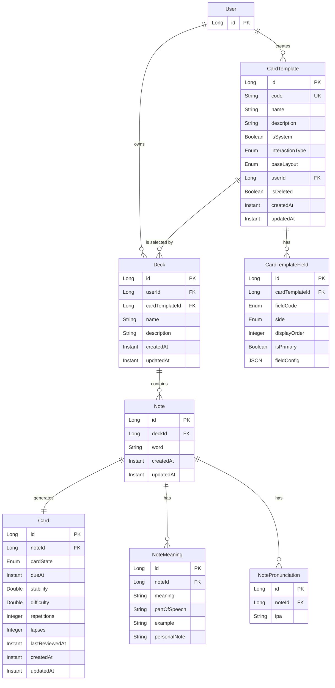

# Đặc tả Chức năng: Custom Card

Tài liệu này mô tả chi tiết chức năng **Custom Card** — cho phép Learner tùy chỉnh cách hiển thị thẻ flashcard khi học, sử dụng các card template do hệ thống cung cấp sẵn kết hợp với khả năng tùy chỉnh nội dung cá nhân.

---

## 1. Tổng quan

### 1.1. Vấn đề cần giải quyết

Hệ thống flashcard hiện tại ([Card.java](file:///c:/Project/snap-vocab/snap-vocab-backend/src/main/java/vn/ptit/snapvocab/domain/Card.java)) chỉ hỗ trợ 2 kiểu thẻ cố định qua enum [CardType](file:///c:/Project/snap-vocab/snap-vocab-backend/src/main/java/vn/ptit/snapvocab/domain/enumeration/CardType.java):

- `WORD_TO_MEANINGS`: Mặt trước hiển thị từ → Mặt sau hiển thị nghĩa
- `MEANINGS_TO_WORD`: Mặt trước hiển thị nghĩa → Mặt sau hiển thị từ

Cách tiếp cận này có **ba hạn chế lớn**:

1. **Thiếu đa dạng**: Không tận dụng được dữ liệu phong phú của Note (phiên âm, audio, ảnh scan, ví dụ, ghi chú cá nhân) cho các kiểu học khác nhau.
2. **Không cá nhân hóa**: Mọi Learner đều thấy cùng một layout thẻ, không thể tùy biến theo phong cách học riêng.
3. **Khó mở rộng**: Muốn thêm kiểu thẻ mới (ví dụ: nghe audio → đoán từ) phải sửa code backend và mobile.

### 1.2. Giải pháp: Card Template System

Lấy cảm hứng từ hệ thống Note Type + Card Template của Anki, nhưng **đơn giản hóa triệt để** — Learner **không cần viết HTML/CSS**, mọi thứ được thao tác qua giao diện trực quan:

| Khía cạnh | Anki | SnapVocab Custom Card |
| :--- | :--- | :--- |
| Tạo template | Viết HTML + CSS + placeholder `{{field}}` | Chọn layout preset, kéo thả/bật tắt field |
| Tạo field | Tự khai báo tên field, kiểu dữ liệu | Hệ thống cung cấp sẵn danh sách field từ Note data |
| Styling | CSS tùy ý | Chọn theme/color scheme có sẵn |
| Số card/note | Tùy ý, do template sinh | Tối đa theo số template được gán vào Deck |
| Độ phức tạp | Cao (power user) | Thấp (mobile-friendly) |

### 1.3. Thuộc Milestone nào?

Chức năng này nằm trong **Milestone 3 — Learning Engine**, mở rộng từ FR-05 (Flashcard) trong [specs.md](file:///c:/Project/snap-vocab/docs/spec/specs.md). Cụ thể, nó bổ sung khả năng tùy chỉnh thẻ học mà Milestone 1 (flashcard cơ bản) chưa bao phủ.

---

## 2. Khái niệm cốt lõi

### 2.1. Card Field (Trường dữ liệu)

Mỗi **Card Field** đại diện cho một phần tử thông tin có thể hiển thị trên thẻ. Hệ thống cung cấp sẵn danh sách field dựa trên dữ liệu của [Note](file:///c:/Project/snap-vocab/snap-vocab-backend/src/main/java/vn/ptit/snapvocab/domain/Note.java) và các entity liên quan:

| Field Code | Tên hiển thị | Loại dữ liệu | Nguồn |
| :--- | :--- | :--- | :--- |
| `WORD` | Từ vựng | Text | `Note.word` |
| `MEANING` | Nghĩa tiếng Việt | Text | `NoteMeaning.meaning` |
| `PART_OF_SPEECH` | Loại từ | Text | `NoteMeaning.partOfSpeech` |
| `EXAMPLE` | Câu ví dụ | Text | `NoteMeaning.example` |
| `PERSONAL_NOTE` | Ghi chú cá nhân | Text | `NoteMeaning.personalNote` |
| `IPA` | Phiên âm IPA | Text | `NotePronunciation.ipa` |
| `AUDIO` | Phát âm | Audio playable | Audio URL từ Dictionary hoặc TTS |
| `IMAGE` | Ảnh minh họa | Image | Ảnh scan crop (cropUrl) hoặc ảnh user upload |

> **Mở rộng tương lai**: Khi hệ thống bổ sung thêm dữ liệu (synonym, antonym, collocation...), chỉ cần thêm Card Field mới mà không ảnh hưởng kiến trúc template.

### 2.2. Card Template (Mẫu thẻ)

Mỗi **Card Template** định nghĩa:

- **Layout**: Cách bố trí các field trên mặt trước (front) và mặt sau (back) của thẻ.
- **Kiểu tương tác**: Flip (lật thẻ), Type-in (gõ đáp án), Tap-to-reveal (chạm từng phần).
- **Field mapping**: Field nào hiển thị ở đâu, với vai trò gì (chính, phụ, gợi ý).

Hệ thống cung cấp **hai loại template**:

#### A. System Templates (Template hệ thống)

Các template được thiết kế sẵn, bảo đảm trải nghiệm tốt trên mobile:

| Template Code | Tên | Mặt trước (Front) | Mặt sau (Back) | Tương tác |
| :--- | :--- | :--- | :--- | :--- |
| `CLASSIC` | Từ → Nghĩa (Classic) | `WORD`, `IPA` | `MEANING`, `PART_OF_SPEECH`, `EXAMPLE`, `AUDIO` | Flip |
| `REVERSE` | Nghĩa → Từ | `MEANING`, `PART_OF_SPEECH` | `WORD`, `IPA`, `AUDIO` | Flip |
| `LISTENING` | Nghe → Đoán từ | `AUDIO` (auto-play) | `WORD`, `MEANING`, `IPA` | Flip |
| `IMAGE_VOCAB` | Ảnh → Từ | `IMAGE` | `WORD`, `MEANING`, `IPA`, `AUDIO` | Flip |
| `SPELLING` | Nghe → Viết từ | `AUDIO` (auto-play), `MEANING` (gợi ý) | `WORD`, `IPA` | Type-in |
| `CONTEXT` | Đoán từ trong ngữ cảnh | `EXAMPLE` (từ chính bị ẩn `___`) | `WORD`, `MEANING`, `IPA`, `AUDIO` | Tap-to-reveal |

#### B. Custom Templates (Template tùy chỉnh)

Learner có thể **tạo template riêng** bằng cách:

1. **Chọn base layout** từ danh sách layout preset (1 cột, 2 cột, ảnh trên-text dưới...).
2. **Kéo thả / bật tắt field** vào mặt trước và mặt sau.
3. **Sắp xếp thứ tự** hiển thị các field.
4. **Chọn field chính (primary)**: Field được hiển thị nổi bật nhất (font lớn, vị trí trung tâm).
5. **Chọn interaction type**: Flip, Type-in hoặc Tap-to-reveal.

### 2.3. Cấu hình Template cho Deck

Mỗi [Deck](file:///c:/Project/snap-vocab/snap-vocab-backend/src/main/java/vn/ptit/snapvocab/domain/Deck.java) chỉ được gán **duy nhất 1 Card Template**. Khi Learner tạo Deck, họ sẽ chọn template mặc định cho Deck đó. Bất cứ Note nào được thêm vào Deck cũng sẽ được hiển thị dưới dạng 1 Card tuân theo khuôn mẫu của Template này.

Ví dụ: Deck "Luyện Nghe IELTS" được gán template `LISTENING` → mỗi Note được thêm vào sẽ chỉ sinh ra đúng 1 Card luyện nghe.

---

## 3. Cơ chế hoạt động

### 3.1. Luồng tạo và sử dụng Custom Card

```
Learner tạo Deck
        │
        ▼
Chọn 1 Card Template cho Deck
   (System hoặc Custom)
        │
        ▼
Thêm Note vào Deck
   (từ scan, dictionary, hoặc nhập thủ công)
        │
        ▼
Hệ thống tự động sinh Card
   (1 Note = 1 Card duy nhất)
        │
        ▼
Learner học Flashcard
   (Card render theo template của Deck)
        │
        ▼
SRS cập nhật lịch ôn cho Card
```

### 3.2. Luồng tạo Custom Template

```
Learner vào "Quản lý Template"
        │
        ▼
Nhấn "Tạo Template mới"
        │
        ▼
Chọn Base Layout
   (1-col, 2-col, image-top, ...)
        │
        ▼
Cấu hình Mặt trước (Front Side)
   ├─ Chọn/bỏ field từ danh sách
   ├─ Sắp xếp thứ tự
   └─ Đánh dấu field chính (primary)
        │
        ▼
Cấu hình Mặt sau (Back Side)
   ├─ Chọn/bỏ field
   ├─ Sắp xếp thứ tự
   └─ Đánh dấu field chính
        │
        ▼
Chọn Interaction Type
   (Flip / Type-in / Tap-to-reveal)
        │
        ▼
Xem Preview (dùng Note mẫu)
        │
        ▼
Lưu Template
```

### 3.3. Card Rendering Logic

Khi Learner mở phiên học flashcard, mobile app nhận từ backend:

1. **Card data**: Thông tin SRS (dueAt, state, stability, difficulty...).
2. **Template config**: Layout, field mapping, interaction type.
3. **Note data**: Giá trị thực tế của các field (word, meanings, ipa, audio, image...).

Mobile app **render card theo template config**, ánh xạ field code vào giá trị từ Note data. Nếu một field trong template không có dữ liệu trong Note (ví dụ: Note không có `IMAGE`), field đó bị ẩn và layout tự điều chỉnh.

### 3.4. Xử lý khi Template thay đổi

| Hành động | Ảnh hưởng |
| :--- | :--- |
| Learner chỉnh sửa Custom Template | Card hiện có render theo config mới trong phiên học tiếp theo. Dữ liệu SRS **không bị ảnh hưởng**. |
| Learner đổi Template của Deck | Toàn bộ Card hiện có trong Deck sẽ được render theo form của Template mới. Không sinh Card mới, dữ liệu điểm SRS cũ vẫn giữ nguyên. |
| Learner xóa Custom Template | Template bị soft-delete. Các Deck đang dùng template này sẽ fallback về template `CLASSIC`. |

---

## 4. Mô hình Dữ liệu

### 4.1. Entity mới

#### `CardTemplate`

Lưu trữ cấu hình một card template.

| Trường | Kiểu | Mô tả |
| :--- | :--- | :--- |
| `id` | `Long` (PK) | ID tự sinh |
| `code` | `String` (unique, nullable) | Mã template cho system template (VD: `CLASSIC`, `LISTENING`). `null` nếu là custom template. |
| `name` | `String` (not null) | Tên hiển thị (VD: "Từ → Nghĩa", "Nghe đoán từ") |
| `description` | `String` | Mô tả ngắn về cách hoạt động |
| `isSystem` | `Boolean` (not null) | `true` = system template (không thể sửa/xóa), `false` = custom template |
| `interactionType` | `Enum` (not null) | `FLIP`, `TYPE_IN`, `TAP_TO_REVEAL` |
| `baseLayout` | `Enum` (not null) | `SINGLE_COLUMN`, `TWO_COLUMN`, `IMAGE_TOP`, `AUDIO_CENTER` |
| `user` | `User` (FK, nullable) | Người tạo. `null` nếu là system template. |
| `isDeleted` | `Boolean` | Soft delete flag |
| `createdAt` | `Instant` | Thời điểm tạo |
| `updatedAt` | `Instant` | Thời điểm cập nhật |

#### `CardTemplateField`

Định nghĩa field nào hiển thị trên mặt nào của template, với thứ tự và vai trò.

| Trường | Kiểu | Mô tả |
| :--- | :--- | :--- |
| `id` | `Long` (PK) | ID tự sinh |
| `cardTemplate` | `CardTemplate` (FK, not null) | Template chứa field này |
| `fieldCode` | `Enum` (not null) | `WORD`, `MEANING`, `IPA`, `AUDIO`, `IMAGE`, `EXAMPLE`, `PART_OF_SPEECH`, `PERSONAL_NOTE` |
| `side` | `Enum` (not null) | `FRONT`, `BACK` |
| `displayOrder` | `Integer` (not null) | Thứ tự hiển thị trên mặt tương ứng (0-based) |
| `isPrimary` | `Boolean` (not null) | `true` = field chính, font lớn, vị trí nổi bật |
| `fieldConfig` | `JSON` (nullable) | Config bổ sung (VD: `{"autoPlay": true}` cho AUDIO, `{"maskPattern": "___"}` cho EXAMPLE ở chế độ CONTEXT) |

**Unique constraint:** `(cardTemplate, fieldCode, side)` — mỗi field chỉ xuất hiện tối đa 1 lần trên mỗi mặt.

### 4.2. Thay đổi Entity hiện có

#### `Deck` — Bổ sung FK tới `CardTemplate`

Do mỗi Deck chỉ dùng 1 Template, ta liên kết trực tiếp Template vào Deck.

```diff
 @Entity
 @Table(name = "deck")
 public class Deck {
     // ... existing fields ...

+    @ManyToOne(fetch = FetchType.LAZY, optional = false)
+    @JoinColumn(name = "card_template_id", nullable = false)
+    private CardTemplate cardTemplate;
 }
```

#### `Card` — Loại bỏ `CardType` và không lưu Template

`CardType` (kiểu enum cũ) không còn cần thiết. `Card` chỉ lưu trạng thái SRS của Note trong Deck; cách hiển thị luôn lấy từ `Deck.cardTemplate`. Không lưu dư thừa `card_template_id` ở `Card` để tránh mâu thuẫn khi Deck đổi Template.

```diff
 @Entity
 @Table(name = "card")
 public class Card {
     // ... existing fields ...

-    @Enumerated(EnumType.STRING)
-    @Column(name = "card_type", nullable = false)
-    private CardType cardType;
 }
```

> **Migration**: Sau migration, `CardType` bị loại bỏ. Template mặc định của Deck hiện có được gán ở `Deck.cardTemplate`, không map từng Card sang Template riêng.

#### `Card` — Cập nhật unique constraint

Vì mô hình mới chốt **1 Note = 1 Card**, unique constraint của `Card` không còn phụ thuộc vào template.

```diff
 @Table(
     name = "card",
     uniqueConstraints = {
-        @UniqueConstraint(
-            name = "uq_card_note_type",
-            columnNames = {"note_id", "card_type"}
-        )
+        @UniqueConstraint(
+            name = "uq_card_note",
+            columnNames = {"note_id"}
+        )
     }
 )
```

### 4.3. Sơ đồ quan hệ



#### Vai trò từng bảng trong mô hình

| Bảng | Vai trò | Ghi chú |
| :--- | :--- | :--- |
| `User` | Chủ sở hữu dữ liệu học tập | Sở hữu Deck và custom template. System template có `userId = null`. |
| `Deck` | Bộ từ vựng và ngữ cảnh học | Mỗi Deck chọn đúng 1 `CardTemplate` qua `cardTemplateId`; đây là nguồn sự thật cho cách render Card. |
| `CardTemplate` | Công thức hiển thị thẻ | Định nghĩa interaction type và layout tổng thể, ví dụ `CLASSIC`, `LISTENING`, `IMAGE_VOCAB`. |
| `CardTemplateField` | Các field xuất hiện trên template | Quy định field nào nằm ở mặt `FRONT`/`BACK`, thứ tự hiển thị, field chính và config phụ. |
| `Note` | Dữ liệu từ vựng gốc trong Deck | Lưu từ chính (`word`) và nối tới các dữ liệu chi tiết như nghĩa/phát âm. |
| `NoteMeaning` | Các nghĩa của một Note | Một Note có thể có nhiều nghĩa; mỗi nghĩa có thể có loại từ, ví dụ và ghi chú cá nhân riêng. |
| `NotePronunciation` | Các phiên âm của một Note | Một Note có thể có nhiều phiên âm IPA. Audio có thể lấy từ Dictionary/TTS theo rule rendering, không nhất thiết nằm trực tiếp trong bảng này. |
| `Card` | Trạng thái học/SRS của Note | Mỗi Note sinh đúng 1 Card. Card không lưu template; khi học, backend lấy template qua `Card.note.deck.cardTemplate`. |

---

## 5. Enumeration mới

### `InteractionType`

```java
public enum InteractionType {
    FLIP,           // Lật thẻ xem đáp án
    TYPE_IN,        // Gõ đáp án, hệ thống so khớp
    TAP_TO_REVEAL   // Chạm từng phần để lộ dần đáp án
}
```

### `BaseLayout`

```java
public enum BaseLayout {
    SINGLE_COLUMN,  // 1 cột, field xếp dọc (mặc định)
    TWO_COLUMN,     // 2 cột song song (VD: trái word, phải image)
    IMAGE_TOP,      // Ảnh phía trên, text phía dưới
    AUDIO_CENTER    // Nút audio lớn ở giữa, text phụ xung quanh
}
```

### `CardFieldCode`

```java
public enum CardFieldCode {
    WORD,
    MEANING,
    PART_OF_SPEECH,
    EXAMPLE,
    PERSONAL_NOTE,
    IPA,
    AUDIO,
    IMAGE
}
```

### `CardSide`

```java
public enum CardSide {
    FRONT,
    BACK
}
```

---

## 6. Quy tắc Nghiệp vụ (Business Rules)

### 6.1. Template

1. **System template không thể sửa/xóa**: Learner chỉ có thể sử dụng hoặc không sử dụng. Hệ thống seed system template khi khởi tạo database.
2. **Custom template thuộc về user**: Learner chỉ xem/sửa/xóa template do mình tạo.
3. **Giới hạn số lượng**: Mỗi Learner tối đa tạo **20 custom templates** (tránh spam, giá trị có thể cấu hình).
4. **Template phải có ít nhất 1 field mỗi mặt**: Front side và back side đều phải có ít nhất 1 field.
5. **Field chính (primary) tối đa 1 per side**: Mỗi mặt chỉ được đánh dấu tối đa 1 field là primary.
6. **Thứ tự hiển thị hợp lệ**: `displayOrder` phải là số nguyên không âm, không trùng trong cùng một cặp `(cardTemplate, side)`. Backend normalize lại thứ tự thành dãy liên tục 0-based khi lưu template.
7. **Type-in interaction bắt buộc**: Nếu `interactionType = TYPE_IN`, mặt back **phải** chứa field `WORD` (vì đó là đáp án Learner cần gõ). Nếu chưa có, backend reject và trả lỗi validation.
8. **Xóa mềm (Soft delete)**: Xóa custom template không xóa vật lý, chỉ đánh flag `isDeleted = true`. Các Deck đang dùng template bị xóa sẽ tự động fallback về system template `CLASSIC`; Card và dữ liệu SRS không bị suspend hoặc reset.

### 6.2. Deck & Card Generation

1. **Deck mặc định**: Khi Learner tạo Deck mới mà không chọn template, hệ thống tự gán system template `CLASSIC`.
2. **1 Note = 1 Card**: Khi Learner thêm Note vào Deck, hệ thống chỉ sinh ra duy nhất 1 Card.
3. **Thay đổi Template**: Khi Learner cập nhật Template của Deck (VD: đổi từ CLASSIC sang LISTENING), các Card cũ KHÔNG bị mất. Chúng chỉ thay đổi "vỏ bọc" (cách render) ở phiên ôn tiếp theo. Điểm SRS được giữ nguyên.

### 6.3. Hiển thị & Rendering

1. **Graceful fallback**: Nếu Note thiếu dữ liệu cho một field trong template (VD: không có `IMAGE`), field đó bị ẩn, layout tự điều chỉnh. Không hiển thị placeholder rỗng gây khó chịu.
2. **Type-in matching**: So khớp không phân biệt hoa/thường, bỏ dấu cách thừa đầu/cuối. Cho phép cấu hình strict mode (phân biệt hoa thường) trong field config.
3. **Audio autoplay**: Chỉ auto-play khi template config có `{"autoPlay": true}` và field ở mặt FRONT. Tôn trọng cài đặt âm thanh của thiết bị.
4. **Field nhiều giá trị**: Với các field lấy từ collection (`MEANING`, `PART_OF_SPEECH`, `EXAMPLE`, `PERSONAL_NOTE`, `IPA`), renderer dùng bản ghi được đánh dấu primary của Note nếu có. Nếu không có primary, dùng bản ghi đầu tiên theo thứ tự lưu trữ ổn định. Mobile có thể hiển thị thêm các giá trị còn lại ở mặt Back khi template field có `fieldConfig: { "showAll": true }`.

### 6.4. SRS & Review

1. **SRS độc lập per Note**: Vì 1 Note = 1 Card, trạng thái SRS gắn liền với Note đó trong Deck.
2. Không còn cơ chế **Sibling Burial** (do không còn thẻ anh em).
3. Không còn cơ chế **Suspend cascade** (do không thể tắt template khỏi Deck, chỉ có thể đổi sang template khác).

---

## 7. API Endpoints

### 7.1. Card Template Management

| Method | Endpoint | Mô tả | Auth |
| :--- | :--- | :--- | :--- |
| `GET` | `/api/v1/card-templates` | Lấy danh sách template (system + custom của user) | Bearer JWT |
| `GET` | `/api/v1/card-templates/{id}` | Xem chi tiết template + fields | Bearer JWT |
| `POST` | `/api/v1/card-templates` | Tạo custom template mới | Bearer JWT |
| `PUT` | `/api/v1/card-templates/{id}` | Cập nhật custom template | Bearer JWT |
| `DELETE` | `/api/v1/card-templates/{id}` | Soft-delete custom template | Bearer JWT |

#### Request: Tạo Custom Template

```json
{
  "name": "Ảnh + Nghĩa → Từ",
  "description": "Xem ảnh kèm nghĩa tiếng Việt, đoán từ tiếng Anh",
  "interactionType": "FLIP",
  "baseLayout": "IMAGE_TOP",
  "fields": [
    {
      "fieldCode": "IMAGE",
      "side": "FRONT",
      "displayOrder": 0,
      "isPrimary": true,
      "fieldConfig": null
    },
    {
      "fieldCode": "MEANING",
      "side": "FRONT",
      "displayOrder": 1,
      "isPrimary": false,
      "fieldConfig": null
    },
    {
      "fieldCode": "WORD",
      "side": "BACK",
      "displayOrder": 0,
      "isPrimary": true,
      "fieldConfig": null
    },
    {
      "fieldCode": "IPA",
      "side": "BACK",
      "displayOrder": 1,
      "isPrimary": false,
      "fieldConfig": null
    },
    {
      "fieldCode": "AUDIO",
      "side": "BACK",
      "displayOrder": 2,
      "isPrimary": false,
      "fieldConfig": { "autoPlay": true }
    }
  ]
}
```

#### Response: Chi tiết Template

```json
{
  "statusCode": 200,
  "data": {
    "id": 15,
    "code": null,
    "name": "Ảnh + Nghĩa → Từ",
    "description": "Xem ảnh kèm nghĩa tiếng Việt, đoán từ tiếng Anh",
    "isSystem": false,
    "interactionType": "FLIP",
    "baseLayout": "IMAGE_TOP",
    "fields": [
      {
        "id": 101,
        "fieldCode": "IMAGE",
        "side": "FRONT",
        "displayOrder": 0,
        "isPrimary": true,
        "fieldConfig": null
      },
      {
        "id": 102,
        "fieldCode": "MEANING",
        "side": "FRONT",
        "displayOrder": 1,
        "isPrimary": false,
        "fieldConfig": null
      },
      {
        "id": 103,
        "fieldCode": "WORD",
        "side": "BACK",
        "displayOrder": 0,
        "isPrimary": true,
        "fieldConfig": null
      }
    ],
    "createdAt": "2026-08-20T03:00:00Z",
    "updatedAt": "2026-08-20T03:00:00Z"
  }
}
```

### 7.2. Deck Management (Cập nhật)

Các API quản lý Deck hiện tại (`POST /api/v1/decks`, `PUT /api/v1/decks/{id}`) cần được bổ sung thêm trường `cardTemplateId` trong request body để cho phép người dùng gán template cho Deck.

### 7.3. Flashcard Session (mở rộng)

API flashcard session hiện có cần bổ sung trả về **template config** để mobile render đúng:

```json
{
  "statusCode": 200,
  "data": {
    "cards": [
      {
        "cardId": 1001,
        "cardState": "REVIEW",
        "dueAt": "2026-08-20T00:00:00Z",
        "template": {
          "id": 1,
          "code": "CLASSIC",
          "interactionType": "FLIP",
          "baseLayout": "SINGLE_COLUMN",
          "frontFields": [
            { "fieldCode": "WORD", "isPrimary": true, "displayOrder": 0 },
            { "fieldCode": "IPA", "isPrimary": false, "displayOrder": 1 }
          ],
          "backFields": [
            { "fieldCode": "MEANING", "isPrimary": true, "displayOrder": 0 },
            { "fieldCode": "PART_OF_SPEECH", "isPrimary": false, "displayOrder": 1 },
            { "fieldCode": "EXAMPLE", "isPrimary": false, "displayOrder": 2 },
            { "fieldCode": "AUDIO", "isPrimary": false, "displayOrder": 3, "fieldConfig": { "autoPlay": false } }
          ]
        },
        "noteData": {
          "word": "perseverance",
          "meanings": [
            {
              "meaning": "sự kiên trì, sự bền bỉ",
              "partOfSpeech": "noun",
              "example": "Success requires perseverance.",
              "personalNote": null
            }
          ],
          "pronunciations": [
            { "ipa": "/ˌpɜːrsəˈvɪərəns/" }
          ],
          "imageUrl": null,
          "audioUrl": "https://storage.example.com/audio/perseverance.mp3"
        }
      }
    ]
  }
}
```

---

## 8. Seed Data — System Templates

Khi khởi tạo database, backend seed 6 system templates:

```sql
-- 1. CLASSIC: Từ → Nghĩa
INSERT INTO card_template (code, name, description, is_system, interaction_type, base_layout, user_id, is_deleted)
VALUES ('CLASSIC', 'Từ → Nghĩa', 'Xem từ tiếng Anh, lật để xem nghĩa tiếng Việt', true, 'FLIP', 'SINGLE_COLUMN', null, false);

-- Front: WORD (primary), IPA
-- Back: MEANING (primary), PART_OF_SPEECH, EXAMPLE, AUDIO

-- 2. REVERSE: Nghĩa → Từ
-- 3. LISTENING: Nghe → Đoán từ
-- 4. IMAGE_VOCAB: Ảnh → Từ
-- 5. SPELLING: Nghe → Viết từ
-- 6. CONTEXT: Đoán từ trong ngữ cảnh
```

> Chi tiết field mapping cho từng system template xem bảng ở mục 2.2.

---

## 9. Migration Plan

### Giai đoạn 1: Backward-compatible

1. Tạo các bảng mới: `card_template`, `card_template_field`.
2. Seed system templates `CLASSIC` và `REVERSE`.
3. Thêm cột `card_template_id` vào bảng `deck` (nullable tạm thời).
4. Migration script: gán template mặc định cho Deck hiện có. Nếu Deck đang chứa Card có `CardType.MEANINGS_TO_WORD` là chủ đạo thì gán `REVERSE`, các trường hợp còn lại gán `CLASSIC`.
5. Cập nhật API học flashcard để lấy template config từ `Deck.cardTemplate` khi trả về Card.

### Giai đoạn 2: Cleanup

1. Đặt `deck.card_template_id` thành `NOT NULL`.
2. Xóa cột `card_type` khỏi `card` (hoặc giữ tạm làm reference, deprecated).
3. Xóa unique constraint cũ `uq_card_note_type`, thay bằng `uq_card_note` theo `note_id`.

---

## 10. Tương tác với các chức năng khác

| Chức năng | Ảnh hưởng |
| :--- | :--- |
| **SRS / Review Queue** | Review queue trả về Card kèm template config lấy từ Deck. Thuật toán SRS không thay đổi (vẫn dựa trên FSRS parameters trên Card). Không cần xử lý sibling/interleave vì 1 Note chỉ sinh 1 Card. |
| **Quiz** | Quiz engine hoạt động độc lập với Card Template, không bị ảnh hưởng. |
| **Daily Mission** | Nhiệm vụ "Học X thẻ Flashcard" đếm theo Card, không phân biệt template. |
| **Progress Tracking** | Progress ghi nhận per Card. Dashboard có thể nhóm hiển thị theo template type nếu muốn phân tích sâu hơn. |
| **Scan-to-Learn** | Khi lưu từ scan vào Deck, Card được sinh theo template đã gán cho Deck đó. Nếu Note có `IMAGE` (crop URL từ scan), template `IMAGE_VOCAB` sẽ tận dụng được dữ liệu này. |

---

## 11. Câu hỏi mở / Quyết định cần xác nhận

| # | Câu hỏi | Gợi ý |
| :--- | :--- | :--- |
| 1 | Có cần hỗ trợ **theme/color scheme** cho template không? | Có thể thêm field `theme` (`LIGHT`, `DARK`, `OCEAN`, `SUNSET`...) vào CardTemplate. Nên để mở rộng sau M4 (Shop/theme). |
| 2 | **Type-in matching** nên dùng thuật toán so khớp nào? | Gợi ý: Levenshtein distance ≤ 1 cho phép 1 lỗi chính tả nhỏ, hiển thị "Gần đúng!" thay vì "Sai". |
| 3 | Có cần **analytics** cho từng template type không? | VD: "Bạn nhớ tốt hơn 23% khi học bằng template Listening so với Classic". Nên để mở rộng sau M3 (Progress analytics). |

---

## 12. Phụ lục: Lịch sử Quyết định Thiết kế (Design Decision)

Trong quá trình thiết kế, bài toán **Gán Template** đã trải qua các vòng lặp cân nhắc sau:

1. **Cách 1 (Linh hoạt tối đa):** Gán Template cho từng Note riêng biệt. Bị loại vì UX quá nặng nề khi thêm từ số lượng lớn, không phù hợp cho Mobile App.
2. **Cách 2 (1 Deck = Nhiều Template):** Gán danh sách Template vào Deck, 1 Note tự sinh ra nhiều Card (Giống logic của ứng dụng Anki). Bị loại do làm phình to dữ liệu không cần thiết và phức tạp hóa thuật toán ôn tập (đòi hỏi xử lý logic giãn cách thẻ anh em - Sibling Burial).
3. **Cách 3 (1 Deck = 1 Template):** Gán duy nhất 1 Template mặc định cho Deck. Đây là **hướng được chốt cuối cùng**.

**Lý do chốt Cách 3 (1 Deck = 1 Template):**
- **Tối giản hóa kiến trúc:** Xóa bỏ bảng trung gian, phương trình sinh thẻ đơn giản tuyệt đối: `1 Note = 1 Card`. Loại bỏ hoàn toàn gánh nặng cho Database.
- **UX cực kỳ thân thiện:** Người dùng chỉ cần phân loại từ vựng thành các Deck theo kỹ năng (VD: Deck "IELTS Reading", Deck "TOEIC Listening"). Mỗi Deck đóng vai trò như một thư mục với một lăng kính học tập chuyên biệt.
- **Phù hợp định hướng Mobile-first:** Tối giản luồng thao tác. Người dùng hoàn toàn thoát khỏi các khái niệm rối rắm, phức tạp, chỉ việc "Tạo Deck -> Chọn cách học -> Ném từ vào -> Bắt đầu học".
