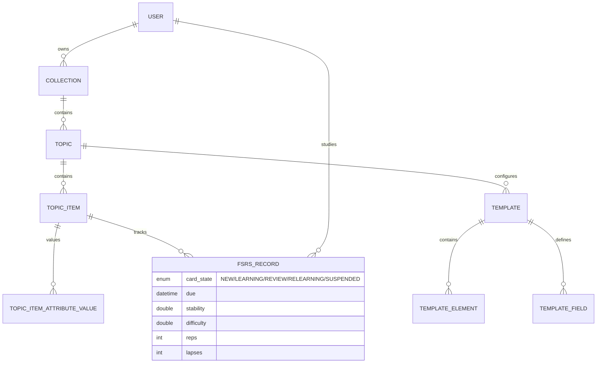
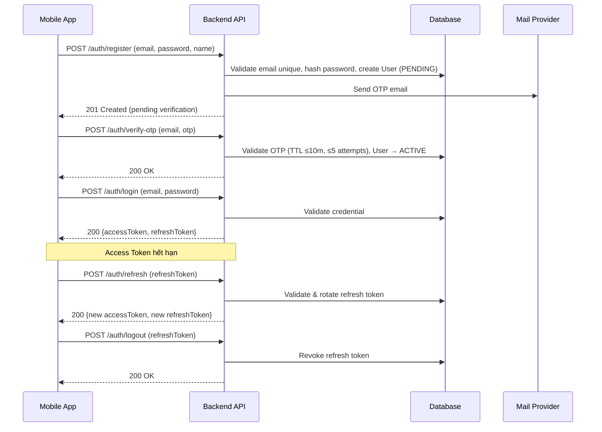
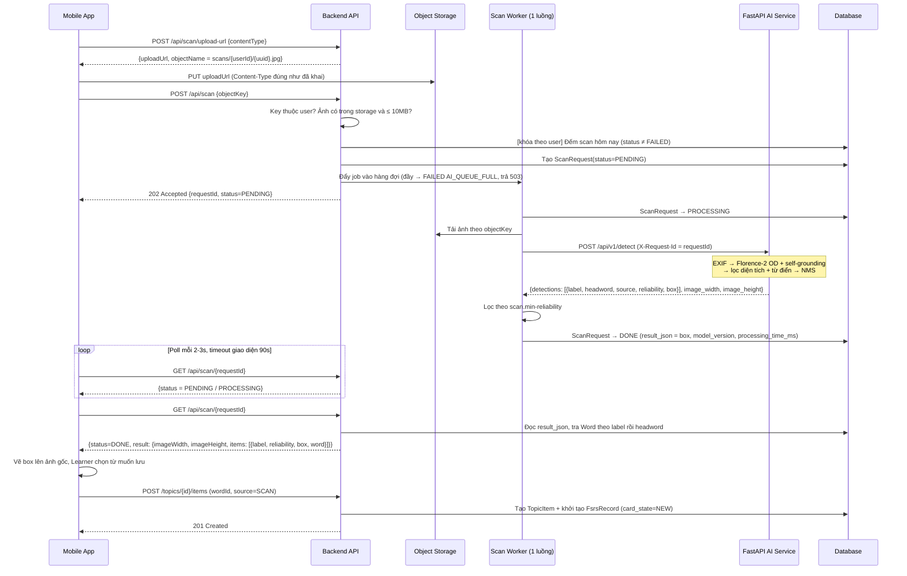
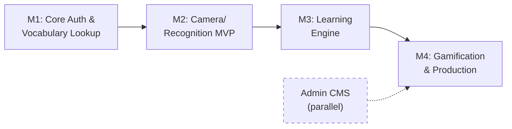
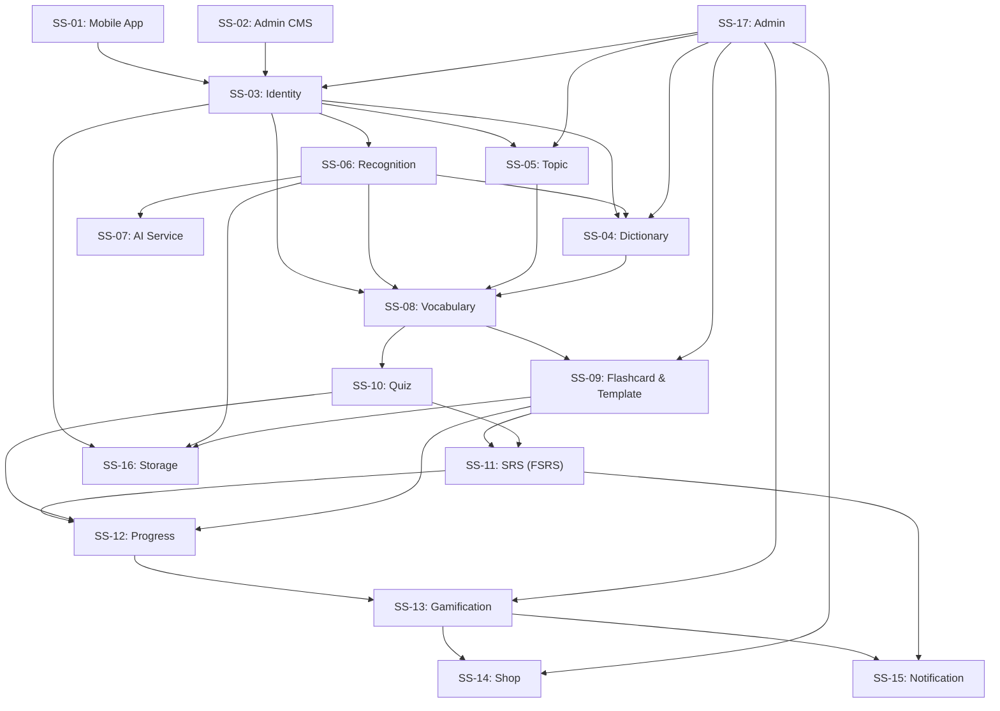

# System Architecture — SnapVocab

> Tài liệu kiến trúc hệ thống tổng thể cho SnapVocab, được xây dựng dựa trên [specs.md](../spec/specs.md), [buss_mainflow.md](../spec/buss_mainflow.md), [phan_ra_phan_he_he_thong.md](../spec/phan_ra_phan_he_he_thong.md), [phan_ra_tinh_nang.md](../spec/phan_ra_tinh_nang.md) và [phan_ra_man_hinh.md](../spec/phan_ra_man_hinh.md).

>
> **Canonical sync (2026-08-23):** Source = [`../spec/specs.md`](../spec/specs.md). AI = Florence-2 zero-shot (+ CLIP tùy chọn; SAM đã gỡ, xem §3.3) · Learning = Collection/Topic/TopicItem/Template · SRS = FSRS (fsrs_records) · Actors = Guest/Learner/Admin · FR: Game=09, Noti=10, Storage=11, OpenAPI=12, Admin=13 · 4 milestones.

---

## 1. Mục tiêu kiến trúc

SnapVocab là hệ thống mobile-first hỗ trợ học từ vựng tiếng Anh thông qua nhận diện hình ảnh (open-vocabulary). Kiến trúc được thiết kế để tách rõ Mobile App, Backend nghiệp vụ, AI Service, Database, Cache và Object Storage, triển khai theo milestone và dễ mở rộng.

### 1.1 Mục tiêu chính

- **Scan-to-learn end-to-end**: Learner chụp/chọn ảnh → AI nhận diện vật thể (Florence-2 zero-shot) → backend ánh xạ sang từ vựng → Learner lưu vào danh sách học cá nhân (Topic cá nhân).
- **Learning engine độc lập**: Saved vocabulary (Topic/TopicItem), Flashcard với Topic Template, Quiz, SRS (FSRS trên `fsrs_records`) và Progress tracking là các module phát triển dần theo milestone.
- **AI service tách rời backend**: Florence-2 pipeline chạy trong FastAPI service riêng (Python + GPU), backend Spring Boot chỉ điều phối và xử lý nghiệp vụ.
- **Data ownership rõ ràng**: MySQL/MariaDB là source of truth cho dữ liệu nghiệp vụ; Object Storage chỉ lưu file/media binary; Redis dùng cho cache/ranking hỗ trợ (từ M3/M4).
- **Bảo mật theo actor**: Guest chỉ dùng auth flow; Learner truy cập dữ liệu cá nhân; Admin dùng CMS web tách biệt (`ROLE_ADMIN`).
- **Sẵn sàng mở rộng**: Kiến trúc hỗ trợ Leaderboard, Missions, Badges, Coin, Shop, Admin CMS và production hardening trong M4.

### 1.2 Quyết định kiến trúc canonical

| Chủ đề | Quyết định | Ghi chú |
| --- | --- | --- |
| Source of truth | [specs.md](../spec/specs.md) | Mọi BF/SS/MH/SA phải truy vết về file này |
| AI pipeline | Florence-2 zero-shot (OD + self-grounding; CLIP chỉ khi bật từ vựng nền) | **Không** dùng YOLO làm model chính; **không** dùng SAM |
| Actor | Guest, Learner, Admin | Admin dùng CMS web tách biệt |
| Learning domain | `Collection` (SYSTEM/USER) → `Topic` → `TopicItem` | "Saved vocabulary" = TopicItem trong Topic cá nhân; **không** entity `SavedWord/UserWord` |
| SRS | FSRS trên `FsrsRecord` (`fsrs_records`) | Trạng thái state/due/stability/difficulty gắn với cặp `(user_id, topic_item_id)` |
| Milestone | 4 mốc (Auth+Dict → Scan → Learning → Game+Prod) | Theo thứ tự ưu tiên triển khai hiện tại |

---

## 2. Kiến trúc tổng quan

### 2.1 Component Diagram

```text
┌──────────────────────────────────────────────────────────────────────────┐
│                          CLIENT LAYER                                    │
│                                                                          │
│  ┌──────────────────────────┐    ┌─────────────────────────┐            │
│  │  React Native / Expo     │    │  Admin CMS              │            │
│  │  Mobile App (iOS/Android)│    │  (Web App — ROLE_ADMIN)  │            │
│  │  TypeScript, Expo Router │    │                          │            │
│  └────────────┬─────────────┘    └────────────┬────────────┘            │
│               │ HTTPS / JSON / JWT             │ HTTPS / JWT             │
└───────────────┼────────────────────────────────┼────────────────────────┘
                │                                │
┌───────────────▼────────────────────────────────▼────────────────────────┐
│                      BACKEND API LAYER                                   │
│                                                                          │
│  ┌──────────────────────────────────────────────────────────────────┐   │
│  │  Spring Boot REST API (Java 17)                                   │   │
│  │  ┌─────────────────────────────────────────────────────────────┐ │   │
│  │  │ Security: Spring Security + JWT + Refresh Token + OTP      │ │   │
│  │  └─────────────────────────────────────────────────────────────┘ │   │
│  │  ┌─────────┐ ┌─────────┐ ┌───────────┐ ┌──────────┐ ┌────────┐│   │
│  │  │Identity │ │Dict     │ │Recognition│ │Vocabulary│ │Topic   ││   │
│  │  │(Auth/   │ │(Word/   │ │(AI Orch.) │ │(Topics/  │ │Template││   │
│  │  │ Profile)│ │ Collec.)│ │           │ │ Items)   │ │ & SRS  ││   │
│  │  └─────────┘ └─────────┘ └───────────┘ └──────────┘ └────────┘│   │
│  │  ┌─────────┐ ┌─────────┐ ┌───────────┐ ┌──────────┐ ┌────────┐│   │
│  │  │Quiz     │ │SRS      │ │Progress   │ │Gamific.  │ │Notif.  ││   │
│  │  │         │ │(FSRS)   │ │Tracking   │ │+Shop     │ │        ││   │
│  │  └─────────┘ └─────────┘ └───────────┘ └──────────┘ └────────┘│   │
│  │  ┌─────────┐ ┌─────────┐ ┌───────────┐                        │   │
│  │  │Storage  │ │Admin    │ │API Docs   │                        │   │
│  │  │(S3/R2)  │ │(CMS API)│ │(OpenAPI)  │                        │   │
│  │  └─────────┘ └─────────┘ └───────────┘                        │   │
│  └──────────────────────────────────────────────────────────────────┘   │
│               │           │            │              │                  │
└───────────────┼───────────┼────────────┼──────────────┼──────────────────┘
                │           │            │              │
    ┌───────────▼───┐ ┌─────▼──────┐ ┌──▼───────────┐ ┌▼──────────────────┐
    │ MySQL/MariaDB │ │ Redis      │ │ Cloudflare   │ │ FastAPI AI Service│
    │ (JPA/Hib.)    │ │ (Redisson) │ │ R2 / MinIO   │ │ (Florence-2,     │
    │               │ │            │ │ (S3-compat.) │ │  CLIP tùy chọn)  │
    │ Source of     │ │ Cache,     │ │ Private      │ │ GPU T4+          │
    │  Truth        │ │ Leaderboard│ │  Bucket      │ │ Zero-shot        │
    └───────────────┘ └────────────┘ └──────────────┘ └──────────────────┘
```

### 2.2 Thành phần chính

| Thành phần | Công nghệ | Trách nhiệm |
| --- | --- | --- |
| Mobile App | React Native, Expo, TypeScript, Expo Router | UI người dùng, camera/gallery, flashcard/quiz/SRS, gọi backend API |
| Admin CMS | Web App nội bộ (JWT ROLE_ADMIN) | Quản lý user, dictionary, topic, templates, gamification, thống kê |
| Backend API | Java 17, Spring Boot REST API | Auth, user, dictionary, topic, recognition orchestration, vocabulary, flashcard, quiz, SRS, progress, gamification, shop, notification, storage, admin, OpenAPI |
| AI Service | Python FastAPI + Florence-2 (base trên CPU, large trên GPU) + CLIP ViT-B/32 (tùy chọn) | Nhận ảnh, chạy pipeline nhận diện từ vựng mở, trả label/headword/source/reliability/box |
| Database | MySQL/MariaDB + JPA/Hibernate | Lưu toàn bộ dữ liệu nghiệp vụ: user, word, learning, gamification, notification |
| Cache | Redis/Redisson | Cache dictionary, leaderboard sorted set, home summary, rate limiting |
| Object Storage | Cloudflare R2 (prod) / MinIO (dev), S3-compatible API | Lưu avatar, ảnh scan, ảnh crop flashcard, tài nguyên vật phẩm |
| API Docs | Swagger/OpenAPI (Springdoc) | Tài liệu hóa backend API cho mobile và AI service tích hợp |
| Design | Figma + Design System | Chuẩn hóa UI, components, typography, colors, states |

---

## 3. View kiến trúc theo layer

### 3.1 Mobile App Layer (SS-01)

**Trách nhiệm:**

- Điều hướng giữa onboarding, auth, home, learn, camera, dictionary, profile.
- Quản lý form đăng nhập/đăng ký/profile/quiz.
- Tương tác camera/gallery và upload media.
- Gọi backend API với JWT access token.
- Xử lý refresh token khi backend trả 401.
- Render flashcard theo cấu hình Topic Template (position, semantic role, styling) từ API.
- Hiển thị empty/loading/error states nhất quán.

**Nhóm màn hình chính (30 màn hình tổng cộng):**

| Nhóm | Màn hình tiêu biểu | Milestone |
| --- | --- | --- |
| ONBOARD / AUTH | Onboarding, Login, Signup, OTP Verify, Forgot/Reset Password | M1 |
| MAIN | Home Dashboard (progress widget, SRS due, streak, quick actions), Learn Hub | M1 |
| CAMERA | Camera Scan, Detection Result (bounding box, save per object) | M2 |
| DICT / TOPIC | Search, Word Detail, Voice Search, Collections, Topic Items | M1 |
| VOCAB | My Vocabulary (Topic List), Topic Detail (TopicItems + filter/sort) | M1 |
| LEARN | Flashcard Study Session, Quiz Setup/Play/Result, SRS Review, Template Management | M1, M3 |
| STATS / GAME | Stats/Progress, Level, Missions, Achievements/Badges, Leaderboard | M3, M4 |
| ECONOMY | Wallet, Shop, Inventory | M4 |
| PROFILE | Profile, Edit Profile, Settings, Notifications | M1, M3 |
| SYSTEM | Design System, Empty/Error/Loading States | Ongoing |

### 3.2 Backend API Layer

**Trách nhiệm:**

- Xác thực, phân quyền và tạo user context từ JWT.
- Cung cấp REST API cho mobile và admin CMS.
- Điều phối nhận diện ảnh: nhận request → lưu ảnh nếu cần → xếp hàng job → gọi AI service → lọc theo `reliability` → map object sang vocabulary (label, rồi headword).
- Xử lý nghiệp vụ learning: Collection/Topic/TopicItem, flashcard (Topic Template), quiz, SRS (FsrsRecord), progress.
- Xử lý gamification: XP, Coin, Mission, Badge, Leaderboard, Shop theo milestone M4.
- Giao tiếp database, Redis và object storage.
- Sinh Swagger/OpenAPI.

**Cấu trúc logical (Controller → Service → Repository):**

```text
controllers
  → auth, user, word, topic, storage, recognition, vocabulary, flashcard,
    quiz, srs, progress, gamification, shop, notification, admin
services
  → business logic, orchestration, transaction boundary
repositories
  → JPA persistence
mappers/dto
  → request/response mapping (MapStruct)
security
  → JWT filter, authentication, authorization (Spring Security)
integrations
  → AI service client, S3 storage client, mail client, Redis client
common
  → ApiResponse envelope, GlobalExceptionHandler, domain events
```

### 3.3 AI Service Layer (SS-07)

**Trách nhiệm:**

- Nhận ảnh (multipart) từ backend; **không** nhận trực tiếp từ mobile.
- Chạy pipeline Florence-2 zero-shot; CLIP chỉ được nạp khi bật bước từ vựng nền.
- Trả kết quả nhận diện có cấu trúc và lỗi có mã.
- **Không** sở hữu dữ liệu user/learning. **Không** chia sẻ database với backend. **Không** lưu ảnh.

**Pipeline mặc định:**

```text
Input Image
  → Xoay theo EXIF (ảnh chụp dọc từ điện thoại), resize cạnh dài ≤ MAX_INPUT_SIZE
  → Florence-2: <OD> + self-grounding (3 lượt gọi model)
  → Loại box quá nhỏ (< 0,4% ảnh) / quá lớn (> 85% ảnh, thường là nền)
  → Lọc nhãn theo từ điển (WordNet, kiểm tra từ cuối của nhãn)
  → NMS 2 tầng + mỗi nhãn giữ 1 box
  → Gắn headword + reliability
  → Output: label, headword, source, reliability, box, image_width/height
```

Các bước tiled OD, dense caption, từ vựng nền (kèm CLIP xác thực) vẫn có trong code nhưng **tắt mặc định**. Số đo thực tế (Florence-2-base, CPU) cho thấy self-grounding cho nhiều nhãn đúng nhất trên mỗi giây; tiled OD và dense caption tốn thêm 20–30s mà chỉ thêm khoảng 1 nhãn; từ vựng nền thêm nhãn nhưng ~40% là sai. Bước cắt nền bằng SAM **đã gỡ bỏ**: app hiển thị ảnh gốc và tự vẽ box.

| Cấu hình | Model | Dùng khi |
| --- | --- | --- |
| `.env.example` | Florence-2-base, OD + self-grounding | CPU / dev |
| `.env.gpu` | Florence-2-large, thêm tiled OD + từ vựng nền (CLIP) | GPU ≥ 4GB VRAM |

**Internal API Contract:** xem chi tiết ở [server.md §5.3](server.md#53-internal-api-contract).

| Field | Mô tả |
| --- | --- |
| Header `X-Request-Id` | `requestId` do backend sinh; AI trả lại trong `request_id` và ghi log |
| Header `X-Service-Token` | Bắt buộc khi AI đặt `SERVICE_TOKEN` |
| `detections[].label` | Nhãn tiếng Anh, đã qua lọc từ điển |
| `detections[].headword` | Từ cuối của nhãn ở dạng số ít (`coffee mugs` → `mug`), dùng tra dự phòng |
| `detections[].source` | `od`, `od_tile`, `self`, `dense`, `base` |
| `detections[].reliability` | `HIGH` / `MEDIUM` / `LOW`, suy ra từ `source` |
| `detections[].score` | Hằng số theo nguồn, chỉ để xếp hạng — **không** phải độ tin cậy |
| `detections[].box` | `{x1, y1, x2, y2}` theo pixel trong hệ `image_width × image_height` (ảnh đã xoay EXIF và resize) |
| `model_version` | Model + các bước bật, vd `Florence-2-base/od+self` |
| `processing_time_ms` | Thời gian chạy model, không tính thời gian xếp hàng |
| Lỗi | `{"error": {"code", "message"}}`: `INVALID_REQUEST`, `INVALID_IMAGE`, `UNAUTHORIZED`, `MODEL_NOT_READY`, `MODEL_ERROR` |

**Endpoints nội bộ:**

| Method | Endpoint | Mô tả |
| --- | --- | --- |
| POST | `/api/v1/detect` | Nhận ảnh (field `file`), trả danh sách detected objects |
| GET | `/health` | Trạng thái nạp model, `model_version`, `gpu_available` |

---

## 4. Phân rã module backend (18 phân hệ)

Hệ thống backend được chia thành **18 phân hệ** thuộc 5 lớp chức năng:

### 4.1 Lớp Presentation

| Module | SS | Trách nhiệm | Milestone |
| --- | --- | --- | --- |
| Mobile App | SS-01 | UI, navigation, camera/gallery, learning, gamification | M1→M4 |
| Admin CMS | SS-02 | Web dashboard quản trị (user, dict, topic, template, game, stats) | M4 |

### 4.2 Lớp Identity & Security

| Module | SS | Trách nhiệm | Milestone |
| --- | --- | --- | --- |
| Identity | SS-03 | Register, login, JWT, refresh token, OTP/email, forgot/reset password, profile | M1 |

### 4.3 Lớp Domain chính

| Module | SS | Trách nhiệm | Milestone |
| --- | --- | --- | --- |
| Dictionary | SS-04 | Word, definition, translation, pronunciation, relations, object-word mapping, import | M1 |
| Topic | SS-05 | Collection/Topic/TopicItem, mô hình EAV, duyệt chủ đề | M1 |
| Recognition | SS-06 | Orchestrate: upload-url → quota → hàng đợi → gọi AI → lọc theo `reliability` → lưu kết quả → map dictionary khi poll | M2 |
| AI Service | SS-07 | Florence-2 pipeline (CLIP tùy chọn), FastAPI, GPU inference | M2 |
| Vocabulary | SS-08 | TopicItem (Saved vocabulary) thuộc Topic cá nhân của Learner, source tracking, unique per Topic | M1–M2 |

### 4.4 Lớp Learning Engine

| Module | SS | Trách nhiệm | Milestone |
| --- | --- | --- | --- |
| Flashcard & Template | SS-09 | Template (gắn theo Topic, system/custom), TemplateElement, TemplateField (SemanticRole), study session, FSRS rating | M1, M3 |
| Quiz | SS-10 | Quiz generation từ TopicItem, MCQ/Matching/Fill, scoring, QuizAttempt (idempotent) | M3 |
| SRS (FSRS) | SS-11 | Review queue (due TopicItems / FsrsRecord), FSRS calculation, overdue priority | M3 |
| Progress | SS-12 | Streak, accuracy, mastered count theo learning-state map, LearningEvent, home widget summary | M3 |

### 4.5 Lớp Engagement & Infrastructure

| Module | SS | Trách nhiệm | Milestone |
| --- | --- | --- | --- |
| Gamification | SS-13 | Level, XP, Coin, Mission, Badge, Leaderboard (Redis sorted set) — idempotent event key | M4 |
| Shop | SS-14 | ShopItem, UserInventory, buy/equip vật phẩm bằng Coin | M4 |
| Notification | SS-15 | Push (Expo/FCM), In-app notification, device token, UserNotification, settings | M3 |
| Storage | SS-16 | Presigned upload/download, MIME/size validation, orphan cleanup, private bucket | M1, M2, M4 |
| Admin (Backend) | SS-17 | API quản trị: user mgmt, dict CRUD, topic, template, game config, dashboard stats | M4 |
| API Documentation | SS-18 | Swagger/OpenAPI, grouped tags, error schema, DTO schemas | M1 (ongoing) |

---

## 5. Kiến trúc dữ liệu

### 5.1 Nhóm entity tổng quan

| Nhóm | Entity | Mục đích | Trạng thái |
| --- | --- | --- | --- |
| **Identity** | User, Authority, RefreshToken, OtpToken | Auth, profile, quyền truy cập | Đã có |
| **Dictionary** | Word, Definition, Translation, Pronunciation, WordDefinition, WordRelation | Từ vựng Anh-Việt (357,729+ từ) | Đã có |
| **Topic** | Collection, Topic, TopicItem, TopicAttributeGroup, TopicAttribute, TopicItemAttributeGroup, TopicItemAttributeValue | Chủ đề học tập EAV linh hoạt, phân cấp | Đã có |
| **Recognition** | ScanRequest, DetectedObject | Nhận diện ảnh, metadata request | Dự kiến M2 |
| **Personal Learning & SRS** | FsrsRecord, TopicItem | Từ cá nhân thuộc Topic, trạng thái FSRS | Đã có |
| **Topic Template** | Template, TemplateElement, TemplateField | Cấu hình giao diện thẻ học theo Topic, semantic role | Đã có |
| **Quiz** | Quiz, Question, QuizAttempt, QuizAnswer | Kiểm tra từ vựng | Dự kiến M3 |
| **Progress** | LearningProgress, LearningEvent | Streak, accuracy, summary aggregate | Dự kiến M3 |
| **Gamification** | Level, Mission, UserMission, Badge, UserBadge, ExperienceLog, CoinTransaction, Leaderboard | Cấp độ, nhiệm vụ, huy hiệu, XP, coin, ranking | Level đã có, còn lại M4 |
| **Economy** | ShopItem, UserInventory | Cửa hàng, túi đồ người dùng | Đã có |
| **Media** | StorageMetadata, UploadSession | Object key, owner, MIME, size | Đã có |
| **Notification** | Notification, UserNotification | In-app notification | Đã có |

### 5.2 Mô hình dữ liệu học tập (canonical)

> **Thuật ngữ UI:** "Từ đã lưu / My Vocabulary" = các `TopicItem` thuộc `Topic` của Learner (trong `Collection` loại `USER`).
> **Không** duy trì entity song song `Deck`/`Note`/`Card`/`SavedWord`/`UserWord`.



### 5.3 Quy tắc ownership dữ liệu

- `User` là nguồn định danh chính; mọi dữ liệu cá nhân phải gắn `user_id`/owner.
- `Word` là dữ liệu dictionary gốc; xóa TopicItem không ảnh hưởng Word.
- `TopicItem/FsrsRecord` là ranh giới giữa dữ liệu từ vựng và tiến trình học tập cá nhân.
- `FsrsRecord.due/SRS fields` gắn chặt vào cặp `(user_id, topic_item_id)`.
- `LearningEvent` là nguồn để rebuild progress, mission và leaderboard khi aggregate lệch.
- `StorageMetadata` lưu metadata object; binary nằm ở Object Storage.
- Leaderboard lưu aggregate trong DB và cache/sorted set trong Redis.

---

## 6. Luồng kiến trúc chính

### 6.1 Auth flow (BF-01, BF-02, BF-03)



**Quy tắc:**
- Password hash ở backend (không plaintext).
- OTP: TTL ≤ 10 phút, max 5 attempts, resend cooldown ≥ 60s, one-time use.
- Access token bảo vệ API cá nhân.
- Refresh token revoke khi logout/reset password/rủi ro bảo mật.
- Sai credential → generic message (chống email enumeration).

### 6.2 Scan-to-vocabulary flow (BF-06)



**Xử lý ngoại lệ:**

| Tình huống | Mã lỗi | Cách xử lý | Tính quota? |
| --- | --- | --- | --- |
| Không nhận diện được vật thể | — | `DONE` với `items` rỗng; empty state + CTA "Thử ảnh khác" | Có |
| Toàn bộ box độ tin cậy thấp | — | Hiển thị kèm cảnh báo; nâng `scan.min-reliability` để lọc ở backend | Có |
| Hết quota | `QUOTA_EXCEEDED` (429) | `data = {limit, used, remaining=0, resetAt}`; không gọi AI | — |
| Hàng đợi đầy | `AI_QUEUE_FULL` (503) | Job đánh dấu `FAILED` ngay | Không |
| Ảnh sai định dạng/quá lớn/chưa upload/không thuộc user | `INVALID_IMAGE` (400) | Kiểm tra trước khi tạo job | Không |
| AI quá thời gian | `AI_TIMEOUT` | Job `FAILED`; mobile hiển thị "Xử lý quá lâu, thử lại" | Không |
| AI không kết nối được / đang nạp model | `AI_UNAVAILABLE` | Job `FAILED`; gợi ý thử lại sau | Không |
| Lỗi model | `AI_ERROR` | Job `FAILED` | Không |
| Restart backend / job quá thời gian tối đa | `INTERRUPTED` | Job `FAILED` (bộ quét định kỳ + lúc khởi động) | Không |
| Label không có trong từ điển | — | Item có `word = null`, đánh dấu "Chưa có từ vựng tương ứng" | — |
| Upload storage lỗi | — | Chưa gọi `POST /api/scan`; mobile cho thử lại | Không |

**Endpoint đồng bộ cũ:** `POST /api/scan` dạng `multipart/form-data` (backend phân biệt với luồng mới qua `Content-Type`) vẫn được giữ tạm trong lúc mobile chuyển sang luồng mới. Endpoint này cũng tạo `ScanRequest` và đi qua quota, nhưng giữ HTTP request mở đến khi AI trả lời và còn trả ảnh vẽ sẵn box nếu AI bật `RETURN_ANNOTATED_IMAGE`.

### 6.3 Capacity, Concurrency & Cost Estimation (AI Service)

Để hệ thống nhận diện chạy được trên GPU giới hạn (ví dụ T4 16GB, hoặc GPU 4GB với Florence-2-large fp16):

- **Concurrency:** AI service chỉ chạy **1 ảnh tại một thời điểm** (semaphore `MAX_CONCURRENT_REQUESTS=1`). Chạy song song không nhanh hơn mà chỉ tranh VRAM.
- **Hàng đợi backend:** 1 worker (`scan.workers`) và tối đa 3 job chờ (`scan.queue-capacity`). Với ~20s/ảnh trên GPU, job cuối vẫn xong trong 90s chờ của giao diện. Vượt quá → `AI_QUEUE_FULL`. Executor này cố ý **không** đăng ký làm Spring bean để `@Async` (gửi mail) vẫn dùng executor mặc định.
- **Hàng đợi nằm trong bộ nhớ:** restart là mất job; bộ quét đánh dấu `INTERRUPTED` mọi job chưa xong lúc khởi động. Thiết kế giả định **một** instance backend; muốn chạy nhiều instance cần chuyển sang hàng đợi dùng chung (vd. Redis).
- **Bộ quét job kẹt:** chạy mỗi 30s. `PROCESSING` quá `read-timeout + 30s` hoặc `PENDING` quá `ceil(queue-capacity / workers) × read-timeout + 30s` (mặc định 90s và 210s) → `INTERRUPTED`. Cột `version` (optimistic lock) chặn kết quả về muộn ghi đè job đã bị quét.
- **Scan Quota:** 20 lượt/ngày/Learner, **đếm trực tiếp từ bảng `scan_requests`** (các dòng có trạng thái khác `FAILED` từ 0h giờ Việt Nam). Một khóa Redisson theo user (`scan:quota-lock:{userId}`) bảo đảm hai request đồng thời không vượt quota. Không dùng bộ đếm Redis riêng: lượt lỗi tự động không bị tính mà không cần code hoàn lượt, và số liệu luôn khớp lịch sử scan.
- **Cost Estimation (T4 GPU - tham khảo AWS/GCP):**
  - Chạy liên tục 24/7 (On-demand): khoảng 200–400 USD/tháng — quá tốn cho đồ án.
  - Spot Instance / Serverless GPU (khuyến nghị cho đồ án): trả theo thời gian dùng, scale về 0 khi không dùng.
- **Cấu hình nhẹ là mặc định:** pipeline mặc định (OD + self-grounding, không tiled OD, không SAM) chính là "Fast Mode" trước đây. Bật thêm các bước qua biến môi trường khi có GPU mạnh.

### 6.4 Learning flow (BF-08, BF-10)

```mermaid
flowchart LR
    A["TopicItem<br>(Topic)"] --> B["Flashcard Session<br>(Template render)"]
    B --> C["Learner tương tác<br>(Flip/Type-in/Tap)"]
    C --> D["FSRS Rating<br>(Again/Hard/Good/Easy)"]
    D --> E["FsrsRecord cập nhật<br>(card_state/due/stability/difficulty)"]
    E --> F["LearningEvent ghi nhận"]
    F --> G["Progress aggregate<br>(streak/accuracy/mastered via learning-state map)"]
    G --> H["Mission/XP/Coin/Badge<br>evaluation (M4)"]
    H --> I["Leaderboard update<br>(Redis sorted set)"]
```



### 6.5 Quiz flow (BF-09)

```text
Mobile quiz setup (chọn Topic/Collection, mode, số câu)
  → Backend sinh quiz từ TopicItems (đáp án nhiễu unique, không quá dễ)
  → Mobile quiz play (MCQ / Matching / Fill blank)
  → Submit answers (idempotent — event key)
  → Backend scoring (score, correctCount, wrongCount, accuracy, duration)
  → QuizAttempt ghi nhận
  → Progress + Gamification events trigger
  → Quiz result UI (điểm, câu sai, XP/coin reward M4)
```

### 6.6 SRS Review flow (BF-10)

```text
System tính Daily Review Queue
  → Lấy FsrsRecord có due ≤ now, ưu tiên overdue
  → Push notification nhắc nhở (nếu bật)
  → Learner mở Review Session
  → Thẻ render theo Topic Template (tương tự Flashcard)
  → FSRS rating: Again/Hard/Good/Easy
  → FsrsRecord update (due, stability, difficulty, reps, lapses)
  → Recall tốt → interval tăng; Recall kém → interval giảm/đưa về LEARNING/RELEARNING theo FSRS
  → Summary khi hết queue

  → Progress cập nhật (streak, accuracy, review count)
```

> **Ràng buộc Kiến trúc MVP (Tối ưu UX):** Hệ thống yêu cầu kết nối mạng khi bắt đầu phiên ôn tập. Tuy nhiên, các thao tác rating (Again/Hard/Good/Easy) phải được queue cục bộ trên thiết bị và đồng bộ về server thông qua cơ chế batching (`POST /reviews/batch` - mỗi 5-10 thẻ hoặc khi kết thúc phiên). Quyết định này khắc phục độ trễ mạng trong thiết kế API đơn thẻ (Chatty API), đảm bảo UX mượt mà khi vuốt thẻ.

### 6.7 Storage upload flow (BF-04)

```text
Mobile request upload URL
  → Backend validate owner, type, size metadata
  → Backend sinh object key + presigned PUT URL + upload session
  → Mobile upload trực tiếp tới Object Storage
  → Mobile gọi POST /storage/upload-complete
  → Backend HEAD object + validate MIME allowlist + size
  → Backend lưu StorageMetadata, link tới profile/scan/item
```

---

## 7. API architecture

### 7.1 Chiến lược Versioning & Cập nhật App

- **Base Path:** Toàn bộ public API của hệ thống bắt buộc sử dụng prefix `/api/v1` (ví dụ: `POST /api/v1/auth/login`).
- **Quy tắc Versioning:** Các thay đổi trong version `v1` phải là **Additive-only** (chỉ thêm field mới, không xóa hay đổi kiểu dữ liệu của field đang tồn tại). Bất kỳ Breaking Change nào cũng yêu cầu tạo ra `/api/v2`.
- **Force Update:** Mobile app khi khởi động (bootstrap) phải gọi `GET /api/v1/app-config` để đối chiếu phiên bản hiện tại với `minSupportedAppVersion`. Nếu phiên bản app thấp hơn, chặn hiển thị giao diện và điều hướng người dùng tới Store để cập nhật.

### 7.2 Nhóm API

| API Group | Consumer | Mục đích | Auth |
| --- | --- | --- | --- |
| Authentication | Mobile, CMS | Register, login, refresh, OTP, reset password | Public / JWT |
| User/Profile | Mobile | Profile view/edit | Learner |
| Storage | Mobile | Presigned upload, upload complete, access URL | Learner |
| Word/Dictionary | Mobile, Backend internal | Search, word detail, pronunciation, mapping | Learner / System |
| Topic | Mobile | Collections, Topics, TopicItems | Learner |
| Recognition | Mobile | `/api/scan`: upload-url, submit, poll kết quả, quota | Learner |
| Topic & Item Vocabulary | Mobile | Save/list/delete personal words (Topic/TopicItem) | Learner |
| Flashcard & Template | Mobile | Cards/session/recall, Template & Element/Field CRUD | Learner |
| Quiz | Mobile | Quiz generate/play/result/history | Learner |
| SRS/Review | Mobile | Review queue, rating submit | Learner |
| Progress | Mobile | Stats, home summary, streak, accuracy | Learner |
| Gamification | Mobile | XP, Coin, Missions, Badges, Leaderboard | Learner |
| Shop/Economy | Mobile | Shop browse/buy, inventory, equip | Learner |
| Notification | Mobile | Notification list/read, device token, settings | Learner |
| Admin | CMS | User mgmt, dict CRUD, topic, template, game config, stats, feedback | Admin |
| AI Service (Internal) | Backend only | POST /api/v1/detect, GET /health | Internal/`X-Service-Token` |

### 7.2 Response và error envelope

Tất cả API public/mobile dùng JSON envelope thống nhất:

```json
{
  "success": true,
  "data": {},
  "error": null,
  "requestId": "uuid"
}
```

```json
{
  "success": false,
  "data": null,
  "error": {
    "code": "RECOGNITION_TIMEOUT",
    "message": "AI service xử lý quá thời gian cho phép.",
    "details": null
  },
  "requestId": "uuid"
}
```

**Error categories:**

| Category | Ví dụ |
| --- | --- |
| Validation | Field rỗng, file sai định dạng, password không hợp lệ |
| Authentication | Token thiếu/hết hạn/sai, OTP sai/hết hạn |
| Authorization | Không có quyền truy cập dữ liệu người khác, không phải ROLE_ADMIN |
| Business | Không đủ từ tạo quiz, không đủ coin mua item, từ trùng trong Topic |
| Integration | AI service timeout, object storage fail, mail fail |
| System | Database error, unexpected error |

---

## 8. Security architecture

### 8.1 Ma trận bảo mật

| Lớp | Quyết định |
| --- | --- |
| Authentication | Spring Security + JWT access token + refresh token |
| Password | Hash an toàn (bcrypt/argon2), không log plaintext |
| OTP | TTL ≤ 10 phút, max 5 attempts, resend ≥ 60s, one-time use, không log |
| Authorization | Learner chỉ truy cập dữ liệu cá nhân; Admin chỉ qua CMS với ROLE_ADMIN |
| Media | Private bucket, presigned URL TTL ≤ 15 phút, backend sinh object key |
| Upload | Validate MIME allowlist (ảnh), size (avatar ≤ 5MB, scan ≤ 10MB), extension |
| AI Service | Ưu tiên mạng nội bộ; nếu public cần service token |
| Idempotency | Reward/XP/Coin/claim mission và submit quiz dùng event key — retry không cộng trùng |
| Secrets | Không đưa secrets vào docs, client, repository; dùng env/secret manager |
| Swagger | Bật dev/staging; production tắt hoặc restrict |
| CORS | Chỉ allow origin cần thiết; không wildcard với credential |

### 8.2 Authorization matrix

| Resource | Guest | Learner | Admin |
| --- | --- | --- | --- |
| Auth (register/login/reset) | Có | — | — |
| Profile (own) | — | Có | — |
| Dictionary search/detail | — | Có | Có |
| Recognition scan | — | Có | — |
| Vocabulary (own Topic/Item) | — | Có (owner-only) | — |
| Flashcard/Quiz/SRS (own) | — | Có (owner-only) | — |
| Progress/Gamification (own) | — | Có (owner-only) | — |
| Shop/Wallet (own) | — | Có (owner-only) | — |
| Notifications (own) | — | Có (owner-only) | — |
| Admin CMS APIs | — | — | Có (ROLE_ADMIN) |
| Storage upload (own media) | — | Có | Có |

---

## 9. Cache và performance

### 9.1 Redis use cases

| Use case | Chiến lược | TTL đề xuất |
| --- | --- | --- |
| Dictionary lookup phổ biến | Cache Word detail/translation trong Redis | 1–24h |
| Leaderboard | Redis sorted set, snapshot cache theo period | 5–15 phút |
| Home dashboard summary | Cache ngắn hạn summary nếu aggregate nặng | 1–5 phút |
| Progress aggregate | Ghi LearningEvent, cập nhật aggregate async | Event-driven |
| AI label → Word mapping | Cache mapping label → Word ID | 24h |
| Shop/catalog | Cache ShopItem public metadata | 1h |
| Rate limiting | Redis counter cho OTP/login/upload | Window-based |
| Mission state | Cache tạm thời mission progress | 5 phút |

### 9.2 Quy tắc cache

- Redis **không** là source of truth. Mọi dữ liệu rebuild được từ database/events.
- Key prefix theo môi trường (dev/staging/prod).
- TTL rõ ràng cho mọi cache tạm thời.
- Distributed lock (Redisson) cho tác vụ concurrent nếu cần (reward processing).

### 9.3 Performance targets

| Metric | Target |
| --- | --- |
| Dictionary lookup p95 | < 500ms (server, exclude mobile network) |
| Recognition flow | Hàng đợi AI + quota scan/ngày; worker timeout 60s (cấu hình được); UX queued/loading/cancel |
| Leaderboard query | Không full-scan aggregate; Redis sorted set |
| Home/progress | Summary table/cache, không tính lại toàn bộ lịch sử |
| Scan-to-save UX | ≤ 3 bước chính sau khi có ảnh |

---

## 10. Storage architecture

### 10.1 Object Storage topology

| Môi trường | Công nghệ |
| --- | --- |
| Dev/Local | MinIO hoặc S3-compatible storage |
| Production | Cloudflare R2 qua S3-compatible API |

### 10.2 Loại media

| Loại | Owner | Giới hạn | Ghi chú |
| --- | --- | --- | --- |
| Avatar | User | ≤ 5MB, image/* | Profile, edit-profile |
| Scan image | User | ≤ 10MB, image/jpeg · png · webp | Key `scans/{userId}/{uuid}.{ext}`; bucket private; chưa có job dọn |
| Item asset | System/ShopItem | — | Icon/vật phẩm gamification |

### 10.3 Upload constraints

- Object key do backend sinh (UUID), không dùng tên file user.
- Backend validate MIME allowlist + size ở upload-complete (không tin client metadata).
- Presigned URL TTL ≤ 15 phút.
- Bucket private; không public trực tiếp.

### 10.4 Cleanup

- Scheduled job xóa object không còn tham chiếu trong DB (orphan).
- Cleanup upload session hết hạn.
- Không xóa binary trước khi DB transaction xác nhận không còn dùng.

---

## 11. Deployment view

### 11.1 Local/Dev

```text
Expo Mobile Dev Client
  → Spring Boot Backend local/dev (port 8080)
  → MySQL/MariaDB local
  → Redis local
  → MinIO/S3-compatible storage local
  → FastAPI AI Service local (GPU hoặc mock)
  → SMTP sandbox (Mailtrap / MailHog)
  → Swagger UI enabled
```

### 11.2 Staging/UAT

```text
Mobile build staging
  → HTTPS Backend API staging
  → Staging DB
  → Staging Redis
  → Staging object bucket
  → AI Service staging (GPU T4)
  → Mail provider staging/test mode
  → Swagger UI enabled
```

### 11.3 Production

```text
Mobile App Store / APK
  → HTTPS Backend API (public)
  → Managed MySQL/MariaDB (private)
  → Redis service (private)
  → Cloudflare R2 private bucket
  → FastAPI AI Service container/VM (private, GPU T4+)
  → Mail provider production
  → Centralized logs/metrics/alerts
  → Swagger off/restricted
```

### 11.4 Quy tắc môi trường

- Config theo environment, không hardcode secrets.
- CORS chỉ cho origin hợp lệ.
- AI service, database, Redis không public trực tiếp.
- Object bucket private, chỉ truy cập qua presigned URL/proxy.
- Production secrets quản lý qua env/secret manager.

---

## 12. Observability và vận hành

### 12.1 Logging

| Hạng mục | Nội dung cần log |
| --- | --- |
| API request | requestId, method, path, status, latency, userId (nếu phù hợp) |
| Auth | Login fail/success, OTP fail/expire, refresh fail, account ban/unban |
| Recognition | requestId, image metadata, model version, processingTimeMs, object count, errors |
| Storage | upload-init, upload-complete, validation fail, orphan cleanup |
| Dictionary | lookup latency, not-found rate, import job result |
| Learning | save word, flashcard recall (rating), quiz attempt, SRS review |
| Gamification | XP/coin transaction, mission complete, duplicate event ignored (idempotent) |
| Leaderboard | cache refresh job, cache miss, ranking update latency |
| System | API error rate, DB/Redis/AI/storage availability, exception stack |

### 12.2 Alert gợi ý

- Backend API error rate tăng cao.
- AI service timeout/error rate tăng.
- Database connection failure.
- Redis unavailable khi leaderboard/cache cần.
- Storage upload failure tăng.
- Mail provider gửi OTP lỗi liên tục.

### 12.3 Health checks

| Check | Thành phần | Mục đích |
| --- | --- | --- |
| `/health` | Backend | Backend process sống |
| DB check | Backend | Kết nối database |
| Redis check | Backend | Kết nối Redis |
| Storage check | Backend | Kiểm tra bucket/presigned URL |
| AI check | Backend/AI | Backend gọi được AI; model ready |
| Mail check | Backend | Mail provider config hợp lệ (dev/staging) |

---

## 13. Mapping kiến trúc với milestone

| Milestone | Thành phần kiến trúc cần hoàn thiện |
| --- | --- |
| **M1 — Core Auth & Vocabulary Lookup** | Mobile auth/profile/search/topic/vocabulary/flashcard basic · Backend auth/user/word/topic/storage · DB dictionary import (357K+ từ) · Swagger |
| **M2 — Camera/Object Recognition MVP** | Camera/Detection UI · Recognition API (orchestrator) · FastAPI Florence-2 service · ObjectWordMapping · Scan image storage optional |
| **M3 — Learning Engine** | Topic Template · Quiz API/UI · SRS engine (FSRS) · Progress aggregate · Notification (Push/In-app) · Learning events |
| **M4 — Gamification & Production** | Mission/Badge/XP/Coin · Shop/Inventory · Leaderboard (Redis) · Admin CMS · R2 production · Observability/hardening |

### Milestone dependency



---

## 14. Dependency graph (phân hệ)



### Coupling notes

- **Loose coupling qua events:** Phân hệ dùng domain event nội bộ (`TopicItemCreated`, `ReviewCompleted`, `QuizSubmitted`, `MissionCompleted`) để giảm coupling trực tiếp.
- **Shared entity:** `TopicItem` và `FsrsRecord` được chia sẻ giữa SS-05/SS-08 (Topic & Item), SS-09 (Flashcard & Template) và SS-11 (SRS). Trách nhiệm tách qua service layer.
- **AI Service tách deploy:** SS-07 là service Python FastAPI độc lập, giao tiếp HTTP nội bộ. **Không** chia sẻ database với backend Spring Boot.
- **Storage crosscutting:** SS-16 là infrastructure service, nhiều domain sử dụng qua cùng interface (S3Client).

---

## 15. Package structure (Backend — Spring Boot)

```text
vn.ptit.snapvocab
├── config/                         (SecurityConfig, ApplicationProperties, CloudflareR2Properties, CorsConfig...)
├── controller/                     (AuthenticationController, CollectionController, TopicController, WordController, ScanController, StorageController...)
├── domain/                         (Entity definitions & mappings)
│   ├── Authority, User, RefreshToken
│   ├── Word, Definition, Translation, Pronunciation, WordDefinition, WordRelation
│   ├── Collection, Topic, TopicItem, TopicAttributeGroup, TopicAttribute, TopicItemAttributeValue
│   ├── Template, TemplateElement, TemplateField
│   ├── FsrsRecord, Level, ShopItem, UserInventory, Notification, UserNotification
│   ├── common/                    (BaseTimeEntity, BaseCreatedAtEntity)
│   ├── enumeration/               (CardState, ReviewRating, SemanticRole, TemplateElementType, CollectionType...)
│   └── mapper/                    (Entity mappers & DTO converters)
├── repository/                    (JPA Repositories cho 25 entity tables)
├── security/                      (JwtTokenProvider, CustomUserDetailsService, SecurityUtils)
├── service/                       (AuthenticationService, CollectionService, TopicService, WordService, ScanService, StorageService...)
│   ├── dto/                       (Request/Response DTOs)
│   └── impl/                      (Service implementations)
└── util/                          (StringUtil, HeaderUtil, PaginationUtil...)
```

---

## 16. Rủi ro kiến trúc và phương án kiểm soát

| # | Rủi ro | Ảnh hưởng | Kiểm soát |
| --- | --- | --- | --- |
| 1 | AI service chậm (15–30s), nghẽn GPU hoặc lỗi | Scan-to-learn gián đoạn | Hàng đợi giới hạn worker/GPU, quota 20 scan/ngày/Learner, timeout 60s (cấu hình), queued/loading UX, tách service riêng scale GPU |
| 2 | Label AI không khớp dictionary Anh-Việt | Không tạo được từ học | ObjectWordMapping + synonym/manual mapping, dictionary miss state UI |
| 3 | Dictionary lớn (357K+ từ) | Lookup/import chậm | Index DB, cache từ phổ biến (Redis), import batch với kiểm tra chất lượng |
| 4 | Reward bị cộng trùng (retry) | Sai coin/XP/leaderboard | Idempotent event key, unique transaction, distributed lock nếu concurrent |
| 5 | Leaderboard query nặng | Home/game chậm | Redis sorted set / snapshot cache, không full-scan aggregate |
| 6 | Media bị public ngoài ý muốn | Lộ dữ liệu cá nhân | Private bucket, presigned URL TTL ≤ 15 phút, owner validation |
| 7 | Florence-2 hallucination | Từ sai trên flashcard | Lọc từ điển + loại box quá nhỏ/lớn; CLIP xác thực (sàn 0.23) khi bật từ vựng nền; app hiển thị `reliability` |
| 8 | Vocabulary collapse khi fine-tune | Mất khả năng gọi từ mới | MVP giữ zero-shot; fine-tune kèm phép đo word-F1 hai chiều |
| 9 | JWT/refresh flow sai | User logout bất ngờ hoặc rủi ro bảo mật | Test auth lifecycle đầy đủ, revoke refresh token đúng |
| 10 | Secret bị commit | Rủi ro bảo mật | Dùng env/secret manager, scan secrets, không copy config thật vào docs |

---

## 17. Tài liệu liên quan

| Tài liệu | Đường dẫn | Vai trò |
| --- | --- | --- |
| Đặc tả yêu cầu (SRS) | [specs.md](../spec/specs.md) | Source of truth |
| Luồng nghiệp vụ | [buss_mainflow.md](../spec/buss_mainflow.md) | BF — actor, bước, ngoại lệ |
| Phân rã phân hệ | [phan_ra_phan_he_he_thong.md](../spec/phan_ra_phan_he_he_thong.md) | SS — ranh giới module, entities, API |
| Phân rã tính năng | [phan_ra_tinh_nang.md](../spec/phan_ra_tinh_nang.md) | F — sub-feature + AC theo FR |
| Phân rã màn hình | [phan_ra_man_hinh.md](../spec/phan_ra_man_hinh.md) | MH — UI map, navigation, states |
| Tech Stack | [techstack.md](./techstack.md) | Công nghệ theo lớp |
| Server & Deployment | [server.md](./server.md) | Môi trường, ops, smoke test |
| Docs index | [README.md](../README.md) | Mục lục + quy tắc đồng bộ |

---

## 18. Checklist nghiệm thu kiến trúc

- [x] Kiến trúc tách rõ: Mobile App, Admin CMS, Backend API, AI Service, Database, Redis, Object Storage.
- [x] 18 phân hệ (SS-01 → SS-18) bao phủ toàn bộ FR-01 → FR-13 trong specs.md.
- [x] Luồng scan-to-learn đầy đủ: camera → presigned upload → hàng đợi + poll → AI service (Florence-2) → reliability filter → label dedup → dictionary mapping (label, rồi headword) → personal vocabulary (TopicItem).
- [x] Learning engine tách thành: Topic & Item Vocabulary, Flashcard & Template, Quiz, SRS (FSRS), Progress.
- [x] Canonical model: Collection → Topic → TopicItem + Template + FsrsRecord. Không `SavedWord`/`UserWord`/`Deck`/`Note`/`Card`.
- [x] AI pipeline: Florence-2 zero-shot (CLIP tùy chọn). Không YOLO, không SAM.
- [x] SRS: FSRS trên FsrsRecord gắn cặp (user_id, topic_item_id) (card_state/due/stability/difficulty).
- [x] Gamification (M4) và Admin CMS không chặn MVP M1–M3.
- [x] Object storage: private bucket, presigned URL, backend sinh object key, orphan cleanup.
- [x] JWT/refresh token, OTP safety, upload validation, media privacy được mô tả rõ.
- [x] Redis: cache dictionary/ranking, leaderboard sorted set, summary cache — không là source of truth.
- [x] OpenAPI/Swagger là thành phần bắt buộc; env-gated.
- [x] Error envelope thống nhất: `{ success, data, error, requestId }`.
- [x] Idempotency: reward/XP/coin/quiz submit dùng event key.
- [x] Security matrix bao phủ Guest/Learner/Admin.
- [x] Rủi ro kiến trúc đã nhận diện và có phương án kiểm soát.
- [x] Package structure mapping đầy đủ cho backend Spring Boot.
- [x] Milestone dependency rõ ràng M1→M2→M3→M4.
- [x] Tài liệu truy vết được về spec files trong [docs/spec/](../spec/).
