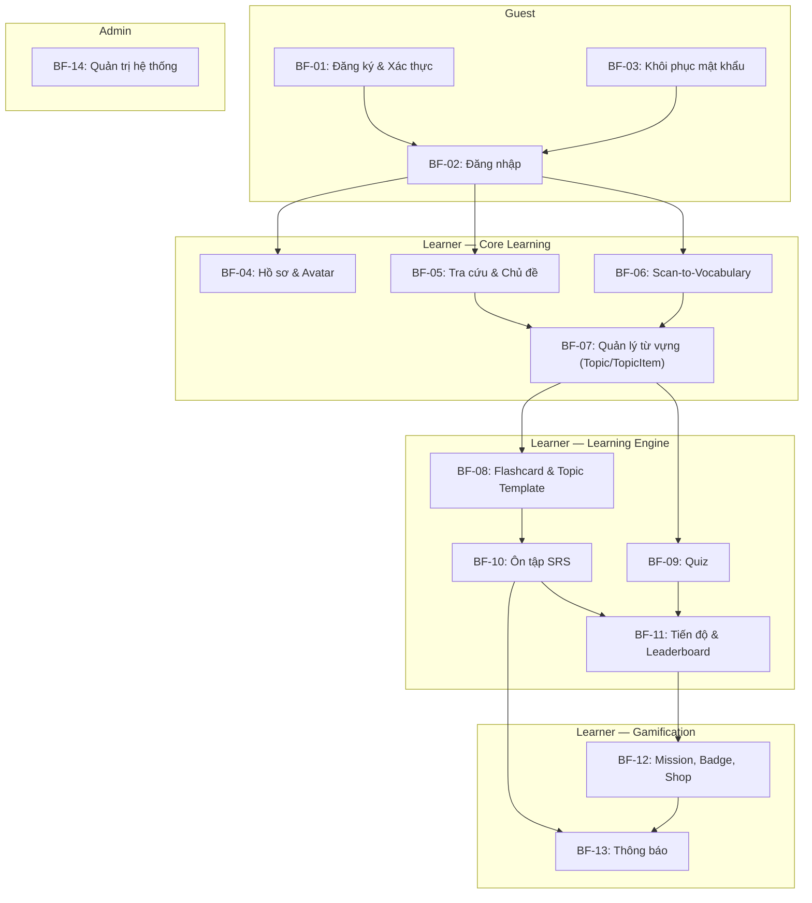

# Luồng nghiệp vụ chính — SnapVocab

> Hub: [specs.md](./specs.md) · Source of truth cho mọi FR/BF/SS/MH.  
> Tài liệu mô tả các **Business Flow (BF)** chính của hệ thống theo format: Actor, Precondition, Happy path, Alternative flow, Exception, Post-condition, Trace.  
> Quyết định canonical: xem mục "Quyết định canonical" trong specs.md §2.

**Quy ước ID:** `BF-{nn}` — mỗi BF là một luồng nghiệp vụ end-to-end, truy vết về FR trong specs.

---

## BF-01 — Đăng ký & Xác thực tài khoản

**Actor:** Guest  
**Trace:** FR-01.01, FR-01.02 · SS-03 · MH: Welcome / Register / OTP Verify  
**Milestone:** M1

### Precondition

- Guest chưa có tài khoản trong hệ thống.
- Guest đang ở màn hình Welcome/Onboarding.

### Happy Path

| Bước | Actor  | Hành động                                                                                     |
| ---- | ------ | --------------------------------------------------------------------------------------------- |
| 1    | Guest  | Mở ứng dụng, xem màn hình Welcome/Onboarding.                                                |
| 2    | Guest  | Chọn **Đăng ký**, nhập email, mật khẩu và thông tin cơ bản (tên hiển thị).                   |
| 3    | System | Validate email unique, password policy (độ dài, ký tự đặc biệt). Hash mật khẩu.              |
| 4    | System | Tạo tài khoản trạng thái `PENDING`. Sinh OTP, gửi qua email.                                 |
| 5    | Guest  | Nhập mã OTP trên màn hình xác thực.                                                          |
| 6    | System | Kiểm tra OTP đúng, chưa hết hạn (TTL ≤ 10 phút), chưa sử dụng. Chuyển tài khoản → `ACTIVE`. |
| 7    | System | Tự động đăng nhập cho Guest và chuyển vào màn hình chính.                                    |

### Alternative Flow

| Mã      | Điều kiện                         | Xử lý                                                                |
| ------- | --------------------------------- | --------------------------------------------------------------------- |
| AF-01.1 | Email đã tồn tại                  | Trả thông báo "Email đã được sử dụng", không tiết lộ chi tiết thêm.  |
| AF-01.2 | OTP hết hạn                       | Cho phép Guest yêu cầu gửi lại OTP (resend cooldown ≥ 60s).          |
| AF-01.3 | Guest nhập sai OTP nhiều lần      | Tối đa 5 lần thử. Sau 5 lần → khóa OTP hiện tại, yêu cầu tạo mới.  |
| AF-01.4 | Mật khẩu không đạt policy         | Trả lỗi cụ thể về yêu cầu mật khẩu, không tạo tài khoản.            |

### Exception

| Mã      | Lỗi                    | Xử lý                                                  |
| ------- | ----------------------- | ------------------------------------------------------- |
| EX-01.1 | Email service lỗi       | Trả thông báo "Không gửi được OTP, vui lòng thử lại."  |
| EX-01.2 | Lỗi hệ thống/database  | Trả error code chung, log chi tiết server-side.         |

### Post-condition

- Tài khoản Guest đã chuyển trạng thái `ACTIVE`.
- Guest có thể đăng nhập bằng email/password.
- OTP đã được đánh dấu đã sử dụng, không tái sử dụng.

### Business Rules

1. Mật khẩu phải hash ở backend, không lưu plaintext.
2. OTP có TTL ≤ 10 phút, tối đa 5 lần thử, resend cooldown ≥ 60s.
3. OTP không được tái sử dụng sau khi xác thực thành công.

---

## BF-02 — Đăng nhập & Quản lý phiên

**Actor:** Guest → Learner  
**Trace:** FR-01.03, FR-01.04, FR-01.06, FR-01.08 · SS-03 · MH: Login / Home  
**Milestone:** M1

### Precondition

- Guest có tài khoản trạng thái `ACTIVE`.

### Happy Path

| Bước | Actor   | Hành động                                                                              |
| ---- | ------- | -------------------------------------------------------------------------------------- |
| 1    | Guest   | Mở màn hình đăng nhập, nhập email và mật khẩu.                                        |
| 2    | System  | Xác thực credential. Nếu hợp lệ → sinh Access Token + Refresh Token.                  |
| 3    | System  | Trả token cho mobile. Guest trở thành Learner.                                         |
| 4    | Learner | Truy cập Home screen với dữ liệu cá nhân.                                             |
| 5    | System  | Khi Access Token hết hạn, mobile dùng Refresh Token để lấy Access Token mới (silent).  |
| 6    | Learner | Khi muốn đăng xuất → gọi logout. System revoke Refresh Token.                          |

### Alternative Flow

| Mã      | Điều kiện                      | Xử lý                                                                          |
| ------- | ------------------------------ | ------------------------------------------------------------------------------- |
| AF-02.1 | Sai email hoặc mật khẩu       | Trả generic message "Thông tin đăng nhập không đúng" (không tiết lộ field sai). |
| AF-02.2 | Tài khoản chưa xác thực       | Redirect sang màn hình OTP verify.                                              |
| AF-02.3 | Tài khoản bị khóa (banned)    | Thông báo "Tài khoản đã bị khóa, liên hệ hỗ trợ."                             |
| AF-02.4 | Đăng nhập bằng sinh trắc học  | Learner bật tính năng → lần sau dùng vân tay/Face ID; fallback password.        |
| AF-02.5 | Refresh Token hết hạn/revoked | Mobile xóa session local, redirect Login.                                       |

### Exception

| Mã      | Lỗi                | Xử lý                                          |
| ------- | ------------------- | ----------------------------------------------- |
| EX-02.1 | Backend unreachable | Mobile hiển thị lỗi kết nối, retry button.      |
| EX-02.2 | Token decode lỗi    | Trả 401 Unauthorized, mobile redirect Login.    |

### Post-condition

- Learner có phiên đăng nhập hợp lệ với Access Token + Refresh Token.
- Khi đăng xuất: Refresh Token bị revoke, session local bị xóa.

### Business Rules

1. Access Token dùng để gọi API; Refresh Token dùng để cấp lại Access Token.
2. Password và OTP không bao giờ được log hoặc trả về response.
3. Refresh Token bị revoke khi đăng xuất hoặc khi có rủi ro bảo mật.
4. Sai credential → trả generic message, không tiết lộ email có tồn tại hay không.

---

## BF-03 — Khôi phục mật khẩu

**Actor:** Guest  
**Trace:** FR-01.05 · SS-03 · MH: Forgot Password / Reset Password  
**Milestone:** M1

### Precondition

- Guest có tài khoản `ACTIVE` nhưng quên mật khẩu.

### Happy Path

| Bước | Actor  | Hành động                                                                                  |
| ---- | ------ | ------------------------------------------------------------------------------------------ |
| 1    | Guest  | Chọn "Quên mật khẩu" trên màn hình đăng nhập, nhập email.                                 |
| 2    | System | Kiểm tra email tồn tại. Sinh OTP/link reset, gửi qua email.                               |
| 3    | Guest  | Nhập OTP hoặc truy cập link reset.                                                         |
| 4    | System | Validate OTP/link. Cho phép nhập mật khẩu mới.                                            |
| 5    | Guest  | Nhập mật khẩu mới (phải pass policy).                                                      |
| 6    | System | Hash và cập nhật mật khẩu. Revoke tất cả phiên đăng nhập cũ. OTP invalidate.               |

### Alternative Flow

| Mã      | Điều kiện                     | Xử lý                                                                    |
| ------- | ----------------------------- | ------------------------------------------------------------------------- |
| AF-03.1 | Email không tồn tại           | Vẫn trả "OTP đã gửi" (chống enumeration), nhưng không gửi email thật.    |
| AF-03.2 | OTP sai / hết hạn             | Xử lý tương tự BF-01: tối đa 5 lần, resend cooldown.                     |
| AF-03.3 | Mật khẩu mới trùng mật khẩu cũ | Bắt buộc đổi mật khẩu khác.                                              |

### Post-condition

- Mật khẩu đã được cập nhật.
- Các phiên đăng nhập cũ đã bị revoke.
- Guest có thể đăng nhập bằng mật khẩu mới.

---

## BF-04 — Hồ sơ cá nhân & Avatar

**Actor:** Learner  
**Trace:** FR-01.07, FR-11.01, FR-11.03, FR-11.04 · SS-03, SS-16 · MH: Profile / Edit Profile  
**Milestone:** M1

### Precondition

- Learner đã đăng nhập (JWT hợp lệ).

### Happy Path

| Bước | Actor   | Hành động                                                                                  |
| ---- | ------- | ------------------------------------------------------------------------------------------ |
| 1    | Learner | Mở tab Profile, xem thông tin cá nhân hiện tại (tên, email, avatar, thống kê học tập).     |
| 2    | Learner | Chọn chỉnh sửa hồ sơ, cập nhật tên hiển thị.                                             |
| 3    | System  | Validate dữ liệu, lưu thay đổi.                                                           |
| 4    | Learner | Chọn thay đổi avatar → chụp ảnh mới hoặc chọn từ thư viện.                                |
| 5    | System  | Cấp presigned upload URL. Mobile upload ảnh trực tiếp lên Object Storage.                  |
| 6    | Mobile  | Upload hoàn tất → gọi API upload-complete.                                                 |
| 7    | System  | Validate MIME (ảnh), kích thước (≤ 5MB). Lưu metadata (object key, owner). Cập nhật user.  |
| 8    | System  | Trả avatar URL tạm thời (presigned, TTL ≤ 15 phút) cho hiển thị.                          |

### Alternative Flow

| Mã      | Điều kiện                       | Xử lý                                                |
| ------- | ------------------------------- | ----------------------------------------------------- |
| AF-04.1 | File không phải ảnh / quá lớn   | Trả lỗi validation kèm giới hạn cho phép.            |
| AF-04.2 | Upload storage lỗi              | Trả thông báo "Upload thất bại, thử lại."            |
| AF-04.3 | Learner chỉ xem, không sửa     | Hiển thị thông tin read-only kèm nút Edit.            |

### Post-condition

- Thông tin hồ sơ hoặc avatar đã được cập nhật.
- Avatar cũ (nếu có) sẽ được cleanup bởi orphan job.
- Learner chỉ xem/sửa dữ liệu cá nhân của chính mình.

### Business Rules

1. Upload media: backend sinh object key, không dùng tên file người dùng nhập.
2. Bucket private; presigned URL TTL ≤ 15 phút.
3. Backend validate loại file/kích thước ở biên hệ thống.
4. Learner chỉ truy cập dữ liệu cá nhân của chính mình.

---

## BF-05 — Tra cứu từ điển & Học theo chủ đề

**Actor:** Learner  
**Trace:** FR-03, FR-14 · SS-04, SS-05 · MH: Dictionary / Search / Topic / Word Detail  
**Milestone:** M1

### Precondition

- Learner đã đăng nhập.
- Database từ vựng đã được import (357,729+ từ).

### Happy Path — Tra cứu văn bản

| Bước | Actor   | Hành động                                                                                           |
| ---- | ------- | --------------------------------------------------------------------------------------------------- |
| 1    | Learner | Mở tab Dictionary / Search, nhập từ tiếng Anh vào ô tìm kiếm.                                     |
| 2    | System  | Tìm kiếm trong database, trả danh sách kết quả phù hợp (p95 < 500ms cho từ phổ biến).             |
| 3    | Learner | Chọn một từ từ danh sách kết quả.                                                                   |
| 4    | System  | Hiển thị Word Detail: từ tiếng Anh, nghĩa tiếng Việt, phiên âm IPA, nút phát âm, loại từ (POS).   |
| 5    | System  | Nếu từ có nhiều nghĩa/loại từ → hiển thị nhóm theo POS rõ ràng.                                    |
| 6    | Learner | (Tùy chọn) Nhấn nút **Lưu từ** → chọn Topic cá nhân hoặc dùng Topic gần nhất/mặc định → tạo TopicItem (xem BF-07). |

### Happy Path — Tra cứu giọng nói (Voice)

| Bước | Actor   | Hành động                                                                                  |
| ---- | ------- | ------------------------------------------------------------------------------------------ |
| 1    | Learner | Nhấn nút microphone, đọc từ/cụm từ tiếng Việt.                                           |
| 2    | Mobile  | Dùng native Speech-to-Text (on-device) chuyển giọng nói thành chữ tiếng Việt.             |
| 3    | System  | Tra cứu ngược (reverse-lookup) trực tiếp chữ tiếng Việt trong bảng nghĩa của database.     |
| 4    | System  | Hiển thị kết quả Word Detail (tương tự luồng văn bản).                                    |

### Happy Path — Duyệt chủ đề (Topic Learning)

| Bước | Actor   | Hành động                                                                                        |
| ---- | ------- | ------------------------------------------------------------------------------------------------ |
| 1    | Learner | Mở mục Collections, duyệt danh sách bộ sưu tập (VD: TOEIC Words, Animals).                     |
| 2    | Learner | Chọn một Collection → xem danh sách Topics (hỗ trợ phân cấp parent/child).                      |
| 3    | Learner | Chọn một Topic → xem danh sách TopicItem (từ vựng/cụm từ) kèm thuộc tính EAV.                  |
| 4    | Learner | Chọn từ cụ thể → xem chi tiết nghĩa, phiên âm, ví dụ từ TopicItemAttributeValue.               |
| 5    | Learner | (Tùy chọn) Nhấn **Lưu từ** → chọn Topic cá nhân hoặc dùng Topic gần nhất/mặc định → tạo TopicItem với `source = TOPIC`. |

### Alternative Flow

| Mã      | Điều kiện                     | Xử lý                                                        |
| ------- | ----------------------------- | ------------------------------------------------------------- |
| AF-05.1 | Từ không có trong database    | Hiển thị "Không tìm thấy từ", gợi ý kiểm tra lại chính tả.  |
| AF-05.2 | Thiếu phiên âm hoặc phát âm  | UI ghi rõ "Chưa có dữ liệu phát âm", không để trống vô nghĩa. |
| AF-05.3 | Voice-to-Text không nhận diện | Hiển thị "Không nhận diện được, vui lòng thử lại."           |
| AF-05.4 | Từ đã lưu trong Topic được chọn | Thông báo "Từ đã có trong chủ đề này", không tạo trùng.     |

### Post-condition

- Learner đã xem thông tin chi tiết từ vựng.
- Nếu lưu: TopicItem mới được tạo trong Topic cá nhân được chọn với `source` phù hợp (DICT/TOPIC).

### Business Rules

1. Database từ vựng là nguồn chính cho thông tin học tập.
2. Nếu field dữ liệu thiếu → UI phân biệt rõ, không crash.
3. Lookup p95 < 500ms cho từ phổ biến (cache Redis top words khi cần).
4. Collection/Topic dùng mô hình EAV linh hoạt.

---

## BF-06 — Scan-to-Vocabulary (Nhận diện ảnh)

**Actor:** Learner  
**Trace:** FR-02, FR-11.02, FR-11.03, FR-11.04 · SS-06, SS-07 · MH: Camera / Scan Result  
**Milestone:** M2

### Precondition

- Learner đã đăng nhập.
- AI service (FastAPI + Florence-2) đang hoạt động và đã nạp xong model.
- Hàng đợi scan còn chỗ nhận job mới.
- Learner còn quota scan trong ngày.
- Mobile có quyền truy cập camera/thư viện.

### Happy Path

| Bước | Actor   | Hành động |
| ---- | ------- | --------- |
| 1    | Learner | Mở tab Camera hoặc chức năng upload ảnh. |
| 2    | Learner | Chụp ảnh mới bằng camera **hoặc** chọn ảnh từ thư viện thiết bị. |
| 3    | Mobile  | Validate MIME (`image/jpeg`, `image/png`, `image/webp`) và kích thước (≤ 10MB) phía client. |
| 4    | Mobile  | Gọi `POST /api/scan/upload-url` với `contentType` → nhận presigned URL và `objectName` dạng `scans/{userId}/{uuid}.{ext}`; upload ảnh thẳng lên Object Storage bằng `PUT` với đúng `Content-Type` đã khai. |
| 5    | System  | Mobile gọi `POST /api/scan` với `objectKey`. Backend kiểm tra key thuộc đúng Learner, ảnh đã được upload và không quá 10MB — **trước** khi tính quota, nên ảnh lỗi không tốn lượt. |
| 6    | System  | Dưới khóa theo từng Learner, backend đếm lượt đã dùng trong ngày và tạo `ScanRequest` (`PENDING`); hết lượt thì trả `QUOTA_EXCEEDED`. Job được đẩy vào hàng đợi trong bộ nhớ; backend trả `202 Accepted` kèm `requestId`, `status = PENDING`. |
| 7    | Mobile  | Hiển thị trạng thái chờ và poll `GET /api/scan/{requestId}` mỗi 2–3s (timeout giao diện 90s). |
| 8    | System  | Worker (1 luồng/GPU) lấy job, đổi sang `PROCESSING`, tải ảnh từ storage và gọi AI service `POST /api/v1/detect` (kèm `X-Request-Id` = `requestId`). |
| 9    | AI      | Xoay ảnh theo EXIF → Florence-2 `<OD>` + self-grounding → loại box quá nhỏ/quá lớn → lọc nhãn theo từ điển (WordNet) → khử box trùng, mỗi nhãn giữ 1 box. |
| 10   | AI      | Trả danh sách object: `label`, `headword`, `source`, `reliability` (HIGH/MEDIUM/LOW), `box`, cùng `image_width`/`image_height` là hệ toạ độ của box. |
| 11   | System  | Backend lọc lần cuối theo `reliability` tối thiểu (cấu hình được) và lưu các box vào `ScanRequest` (`DONE`). |
| 12   | System  | Khi mobile poll, backend ánh xạ label sang Word: tra nguyên nhãn trước (`coffee mug`), không có thì tra `headword` (`mug`). |
| 13   | Mobile  | Hiển thị ảnh gốc và **tự vẽ box** theo toạ độ (nhân với `chiều_rộng_hiển_thị / imageWidth`), tô màu theo `reliability`. |
| 14   | Learner | Xem danh sách đối tượng, chạm vào box hoặc danh sách để chọn từ muốn lưu. |
| 15   | Learner | Nhấn **Lưu** → chọn Topic cá nhân hoặc dùng Topic gần nhất/mặc định → tạo TopicItem và khởi tạo FsrsRecord với `source = SCAN` (xem BF-07). |

### Alternative Flow

| Mã      | Điều kiện | Xử lý |
| ------- | --------- | ----- |
| AF-06.1 | Ảnh không hợp lệ (MIME/size), chưa upload, hoặc key không thuộc Learner | Backend trả `INVALID_IMAGE`, **không** trừ lượt; gợi ý chọn ảnh khác. |
| AF-06.2 | Không nhận diện được đối tượng | Job vẫn `DONE` với danh sách rỗng (không phải lỗi); mobile hiển thị "Không nhận diện được vật thể, hãy thử ảnh rõ hơn." + CTA. Lượt này **có** tính quota. |
| AF-06.3 | Tất cả object có `reliability` thấp | Hiển thị kết quả kèm cảnh báo độ tin cậy thấp; có thể nâng `scan.min-reliability` để backend tự lọc. |
| AF-06.4 | Label không map được sang dictionary | Item có `word = null`: hiển thị nhãn, đánh dấu "Chưa có từ vựng tương ứng". Nút "Báo từ thiếu" đẩy nhãn vào Feedback Queue (Trace: FR-02.05, FR-13). Vì từ vựng được tra lúc đọc kết quả, khi Admin bổ sung từ thì kết quả cũ cũng hiện từ mới. |
| AF-06.5 | Nhiều box cùng label | AI chỉ giữ 1 box cho mỗi label (box có điểm cao nhất). |
| AF-06.6 | Nút nổi Android (Bubble) | Learner dùng overlay widget chụp màn hình từ app khác → pipeline tương tự. |
| AF-06.7 | Hết quota scan trong ngày | Backend trả `429 QUOTA_EXCEEDED`, `data = {limit, used, remaining = 0, resetAt}`; mobile hiển thị giờ reset và CTA quay lại học từ đã lưu. |
| AF-06.8 | Job đang chờ hoặc đang xử lý | Poll trả `PENDING`/`PROCESSING`; mobile tiếp tục hiển thị tiến trình (tối đa 90s) và cho phép hủy. |

### Exception

| Mã      | Lỗi | Xử lý |
| ------- | --- | ----- |
| EX-06.1 | AI không trả lời trong `ai-service.read-timeout-ms` (mặc định 60s) | Job `FAILED` với `errorCode = AI_TIMEOUT`, không tính lượt; mobile hiển thị "Xử lý quá lâu, thử lại." |
| EX-06.2 | AI service không kết nối được hoặc đang nạp model | Job `FAILED` với `AI_UNAVAILABLE`, không tính lượt; gợi ý thử lại sau. |
| EX-06.3 | Upload storage lỗi | Mobile hiển thị "Upload thất bại", nút thử lại; chưa gọi `POST /api/scan` nên không tốn lượt. |
| EX-06.4 | Lỗi model hoặc ảnh không giải mã được | AI trả `{"error": {"code", "message"}}`; backend ghi `AI_ERROR` hoặc `INVALID_IMAGE` vào job, không tính lượt. |
| EX-06.5 | Hàng đợi đầy | Backend trả `503 AI_QUEUE_FULL`; job được đánh dấu `FAILED` ngay nên không tính lượt. |
| EX-06.6 | Backend khởi động lại hoặc job quá thời gian tối đa | Job bị đánh dấu `FAILED` với `INTERRUPTED`, không tính lượt; mobile poll nhận trạng thái này và cho phép thử lại. |

### Post-condition

- Learner đã xem danh sách từ vựng nhận diện được từ ảnh hoặc trạng thái lỗi/chờ xử lý rõ ràng.
- Hệ thống **không** tự động lưu toàn bộ kết quả — chỉ lưu khi Learner xác nhận.
- Mỗi lượt scan có một bản ghi `scan_requests`: `requestId`, trạng thái, `errorCode`, `modelVersion`, số object, thời gian xử lý của AI, thời điểm bắt đầu/kết thúc.
- App không crash ở mọi trường hợp lỗi.

### Business Rules

1. Nhãn từ AI service đã qua lọc từ điển (WordNet) phía AI; backend ánh xạ sang Word theo nhãn rồi theo `headword`.
2. Backend giữ thêm một lớp lọc theo `reliability` tối thiểu (`scan.min-reliability`, mặc định `LOW` = giữ tất cả).
3. Mỗi label chỉ trả 1 box để tránh từ vựng lặp.
4. Quota mặc định 20 scan/ngày/Learner (`scan.quota-per-day`), reset lúc 0h giờ `Asia/Ho_Chi_Minh`. Quota được **đếm từ bảng `scan_requests`**: mọi bản ghi có trạng thái khác `FAILED` tính 1 lượt, nên mọi lượt lỗi tự động không bị tính. Endpoint đồng bộ cũ cũng đi qua quota.
5. Hàng đợi trong bộ nhớ, 1 worker/GPU, tối đa 3 job chờ (`scan.queue-capacity`) để job cuối vẫn xong trong 90s chờ của giao diện. Hàng đợi mất khi restart; giả định chạy **một** instance backend.
6. Mobile không giữ kết nối đồng bộ; dùng `requestId` để poll với các trạng thái `PENDING`/`PROCESSING`/`DONE`/`FAILED`.
7. Không tự động lưu kết quả scan nếu Learner chưa xác nhận.
8. Ảnh scan lưu trong bucket private dưới `scans/{userId}/`; key chứa userId để backend kiểm tra quyền sở hữu. Chưa có job dọn ảnh cũ.
9. Timeout backend → AI cấu hình được (mặc định 60s); job chạy quá timeout + 30s, hoặc chờ quá (số job phía trước × timeout) + 30s, bị đánh dấu `INTERRUPTED`.
10. Mọi lỗi scan có mã (`INVALID_IMAGE`, `QUOTA_EXCEEDED`, `AI_QUEUE_FULL`, `AI_UNAVAILABLE`, `AI_TIMEOUT`, `AI_ERROR`, `INTERRUPTED`), trả trong `RestResponse.error` hoặc `errorCode` khi poll; app không crash.

---

## BF-07 — Quản lý từ vựng cá nhân (Collection / Topic / TopicItem)

**Actor:** Learner  
**Trace:** FR-04, FR-05.01 · SS-08, SS-09 · MH: My Vocabulary / Topic Detail  
**Milestone:** M1 (cơ bản), M2 (từ scan)

### Precondition

- Learner đã đăng nhập.
- Learner có ít nhất 1 Collection và Topic cá nhân (hệ thống tự động tạo Topic mặc định khi tài khoản đăng ký).

### Happy Path — Lưu từ mới

| Bước | Actor   | Hành động                                                                                                      |
| ---- | ------- | -------------------------------------------------------------------------------------------------------------- |
| 1    | Learner | Từ Word Detail (BF-05) hoặc Scan Result (BF-06), nhấn **Lưu từ**/**Lưu tất cả**.                              |
| 2    | System  | Xác định Topic đích: dùng Topic gần nhất; nếu chưa có thì dùng Topic mặc định; Learner có thể nhấn **Đổi Topic** để chọn Topic khác trước khi xác nhận. |
| 3    | System  | Kiểm tra từ trùng trong Topic đích (unique per Topic rule).                                                    |
| 4    | System  | Tạo `TopicItem` mới trong Topic, gắn các giá trị thuộc tính tương ứng vào `TopicItemAttributeValue`.          |
| 5    | System  | Khởi tạo bản ghi `FsrsRecord` cho cặp `(user_id, topic_item_id)` ở trạng thái `NEW` với các tham số FSRS mặc định. |
| 6    | System  | Trả xác nhận "Đã lưu vào <Topic name>" kèm action "Đổi Topic" khi còn ở màn kết quả/chi tiết.                 |

### Happy Path — Xem & Quản lý danh sách

| Bước | Actor   | Hành động                                                                                        |
| ---- | ------- | ------------------------------------------------------------------------------------------------ |
| 1    | Learner | Mở My Vocabulary → xem danh sách `TopicItem` trong Topic cá nhân.                                |
| 2    | Learner | Lọc theo trạng thái học tập (new, learning, reviewing, mastered), ngày lưu, độ khó, ngày ôn tiếp theo. |
| 3    | Learner | Xem chi tiết một mục từ: từ, nghĩa, phiên âm, ví dụ, trạng thái ôn tập FSRS.                     |
| 4    | Learner | (Tùy chọn) Xóa mục từ khỏi Topic cá nhân.                                                        |
| 5    | System  | Khi xóa mục từ khỏi Topic: `TopicItem` và `FsrsRecord` liên quan được dọn dẹp. Dữ liệu từ điển gốc **không** bị xóa. |

### Alternative Flow

| Mã      | Điều kiện                           | Xử lý                                                         |
| ------- | ----------------------------------- | -------------------------------------------------------------- |
| AF-07.1 | Từ trùng trong cùng Topic           | Thông báo "Từ đã có trong chủ đề này", không tạo trùng.         |
| AF-07.2 | Topic chưa có Template riêng        | Gán Template mặc định của hệ thống.                           |
| AF-07.3 | Learner chưa có từ vựng nào         | Hiển thị empty state + CTA "Tra cứu / Scan để thêm từ mới".   |

### Post-condition

- `TopicItem` mới đã được tạo trong Topic đích đã xác nhận kèm bản ghi `FsrsRecord`.
- Mục từ đã sẵn sàng cho Flashcard, Quiz, SRS.
- Xóa mục từ cá nhân không ảnh hưởng dữ liệu từ điển gốc.

### Business Rules

1. **Canonical model:** `Collection` (type `USER`) → `Topic` → `TopicItem`. UI "My Vocabulary" = danh sách `TopicItem` trong Topic cá nhân.
2. **Không** tạo entity `SavedWord`/`UserWord` song song.
3. Unique per Topic: 1 Learner không lưu trùng lặp cùng một từ trong cùng một Topic.
4. Luồng Save từ mọi nguồn (DICT/TOPIC/SCAN) dùng cùng pattern Topic đích: Topic gần nhất → Topic mặc định → tùy chọn Đổi Topic.
5. `TopicItem` kết hợp `FsrsRecord` là nguồn dữ liệu đầu vào cho Flashcard, Quiz, SRS.

---

## BF-08 — Học Flashcard (Topic Template & FSRS)

**Actor:** Learner  
**Trace:** FR-05 · SS-09 · MH: Flashcard / Study Session  
**Milestone:** M1 (cơ bản), M3 (Topic Template đầy đủ cấu hình position, semantic_role, styling)

### Precondition

- Learner có ít nhất 1 `TopicItem` trong Topic cần học.
- Topic đã được cấu hình Template hiển thị thẻ.

### Happy Path

| Bước | Actor   | Hành động                                                                                           |
| ---- | ------- | --------------------------------------------------------------------------------------------------- |
| 1    | Learner | Mở Topic → chọn **Học Flashcard** hoặc vào study session từ Home.                                   |
| 2    | System  | Lấy danh sách mục từ cần học (`card_state = NEW` hoặc `due <= now`). Tải cấu hình `Template` của Topic (danh sách `TemplateElement` và `TemplateField` theo `position ASC`). |
| 3    | Learner | Xem mặt trước (Front) của thẻ: các trường có `semantic_role` là `FRONT`, kèm `PHONETIC`, `AUDIO` (nếu có). |
| 4    | Learner | Tương tác: lật thẻ, nghe phát âm.                                                                   |
| 5    | System  | Hiển thị mặt sau (Back): các trường có `semantic_role` là `BACK`, `TRANSLATION`, `EXAMPLE`...       |
| 6    | Learner | Đánh giá mức độ nhớ theo FSRS (Again, Hard, Good, Easy).                                           |
| 7    | System  | Cập nhật tham số FSRS trên `FsrsRecord` (`stability`, `difficulty`, `due`, `reps`, `lapses`, `card_state`). |
| 8    | System  | Chuyển sang mục từ tiếp theo. Lặp lại bước 3–7.                                                     |
| 9    | System  | Khi hết thẻ → hiển thị tổng kết phiên học (số thẻ đã ôn, tỷ lệ nhớ).                               |

### Alternative Flow

| Mã      | Điều kiện                         | Xử lý                                                                       |
| ------- | --------------------------------- | ---------------------------------------------------------------------------- |
| AF-08.1 | Topic không có từ nào             | Empty state + CTA "Lưu thêm từ để bắt đầu học."                            |
| AF-08.2 | Thay đổi Template cho Topic       | Dữ liệu ôn tập FSRS của các mục từ giữ nguyên; chỉ thay đổi giao diện hiển thị ở phiên tiếp theo. |
| AF-08.3 | Mục từ thiếu dữ liệu thuộc tính   | Tự động ẩn trường khuyết thiếu nếu có cờ `hide_if_empty = true`, không gây lỗi giao diện. |

### Post-condition

- Tham số FSRS trên `FsrsRecord` đã được cập nhật → ảnh hưởng lịch ôn tập tiếp theo.
- Tiến độ học tập và điểm kinh nghiệm (XP) được ghi nhận.

### Business Rules

1. Template gắn liền với `Topic`, áp dụng cho toàn bộ các `TopicItem` trong Topic đó.
2. 1 `TopicItem` tương ứng 1 bản ghi `FsrsRecord` cho mỗi người học.
3. Khi thay đổi Template: tiến trình học tập FSRS không bị xáo trộn.
4. Trường thiếu dữ liệu → tự động ẩn nếu `hide_if_empty = true`, giao diện co giãn hợp lý.

---

## BF-09 — Quiz & Kiểm tra

**Actor:** Learner  
**Trace:** FR-06 · SS-10 · MH: Quiz / Quiz Result  
**Milestone:** M3

### Precondition

- Learner có đủ TopicItem trong Topic để sinh quiz (hệ thống cần số lượng tối thiểu cho đáp án nhiễu).

### Happy Path

| Bước | Actor   | Hành động                                                                                           |
| ---- | ------- | --------------------------------------------------------------------------------------------------- |
| 1    | Learner | Mở Quiz từ Topic hoặc từ Home. Chọn loại quiz (multiple choice, matching, fill blank).             |
| 2    | System  | Sinh bộ câu hỏi từ TopicItem. Tạo đáp án đúng + đáp án nhiễu (lấy cùng Topic/POS, không trùng).     |
| 3    | Learner | Trả lời từng câu hỏi.                                                                               |
| 4    | System  | Sau mỗi câu: phản hồi đúng/sai (tuỳ mode). Sau quiz: tính điểm, tỷ lệ chính xác.                 |
| 5    | System  | Lưu QuizAttempt: điểm, số câu đúng/sai, thời gian làm, timestamp.                                 |
| 6    | System  | Cập nhật Progress (XP, accuracy). Kiểm tra Mission nếu M4 bật.                                      |

### Alternative Flow

| Mã      | Điều kiện                        | Xử lý                                                                   |
| ------- | -------------------------------- | ------------------------------------------------------------------------ |
| AF-09.1 | Số TopicItem chưa đủ sinh quiz   | Hiển thị CTA "Lưu thêm từ trước khi tạo quiz."                         |
| AF-09.2 | Learner thoát giữa chừng        | Hủy bỏ, không ghi QuizAttempt chưa hoàn thành.                                         |
| AF-09.3 | Retry quiz (cùng attempt)        | Idempotent submit — retry không cộng trùng điểm/XP (dùng event key).    |

### Exception

| Mã      | Lỗi              | Xử lý                                        |
| ------- | ----------------- | --------------------------------------------- |
| EX-09.1 | API lỗi khi submit | Trả error code, mobile giữ answer local để retry. |

### Post-condition

- QuizAttempt đã được ghi nhận.
- Progress, XP, accuracy được cập nhật.
- Kết quả quiz không cập nhật thông số FSRS (chỉ ghi nhận QuizAttempt, progress, XP).

### Business Rules

1. Đáp án nhiễu lấy từ TopicItem cùng Topic/POS, không trùng nghĩa.
2. Submit quiz idempotent (event key, retry không cộng trùng).
3. Kết quả quiz không cập nhật thông số FSRS (chỉ ghi nhận QuizAttempt, progress, XP).
4. Yêu cầu số TopicItem tối thiểu để sinh quiz.

---

## BF-10 — Ôn tập SRS (Spaced Repetition System)

**Actor:** Learner  
**Trace:** FR-07, FR-10.01 · SS-11, SS-15 · MH: Review / Home (due count)  
**Milestone:** M3

### Precondition

- Learner có bản ghi `FsrsRecord` với `due ≤ now` (đến hạn ôn tập).

### Happy Path

| Bước | Actor   | Hành động                                                                                             |
| ---- | ------- | ----------------------------------------------------------------------------------------------------- |
| 1    | System  | Tính Daily Review Queue: lấy tất cả `FsrsRecord` của Learner có `due ≤ now`, ưu tiên overdue trước.  |
| 2    | System  | (Push Notification) Nếu Learner bật nhận thông báo → gửi push nhắc nhở ôn tập SRS.                  |
| 3    | Learner | Mở app → Home hiển thị số từ cần ôn hôm nay. Nhấn vào để bắt đầu phiên ôn.                          |
| 4    | System  | Hiển thị thẻ theo cấu hình Template của Topic tương ứng (tương tự BF-08).                            |
| 5    | Learner | Xem thẻ → đánh giá mức nhớ FSRS (Again, Hard, Good, Easy).                                           |
| 6    | System  | Cập nhật `FsrsRecord`: card_state, due, stability, difficulty, reps, lapses theo FSRS.                |
| 7    | System  | **Recall tốt** → tăng khoảng cách ôn (interval dài hơn). **Recall kém** → giảm hoặc đưa về LEARNING/RELEARNING theo FSRS. |
| 8    | System  | Chuyển thẻ tiếp theo. Lặp đến hết queue → hiển thị summary.                                           |
| 9    | System  | Cập nhật Progress (số lượt ôn, streak, accuracy).                                                     |

### Alternative Flow

| Mã      | Điều kiện                       | Xử lý                                                                  |
| ------- | ------------------------------- | ----------------------------------------------------------------------- |
| AF-10.1 | Không có thẻ đến hạn            | Home hiển thị "Bạn đã hoàn thành các từ cần ôn hôm nay!" hoặc số due = 0. |
| AF-10.2 | Thẻ quá hạn ôn (overdue)        | Ưu tiên trong review queue trước các thẻ vừa đến hạn.                 |
| AF-10.3 | Learner muốn reset lịch học     | Cho phép reset `FsrsRecord` về trạng thái `NEW`.                       |
| AF-10.4 | Learner bỏ giữa chừng          | `FsrsRecord` chưa review giữ nguyên trong queue cho lần sau.           |

### Post-condition

- `FsrsRecord` đã ôn có giá trị `due` mới theo FSRS.
- Tiến độ học tập và chuỗi học liên tục (streak) được cập nhật nếu hoàn thành điều kiện trong ngày.

### Business Rules

1. FSRS trực tiếp trên `FsrsRecord` (`fsrs_records`): `card_state`, `due`, `stability`, `difficulty`, `reps`, `lapses`.
2. Review queue chỉ gồm `FsrsRecord` của Learner hiện tại.
3. Recall tốt → interval tăng; recall kém → interval giảm hoặc đưa về LEARNING/RELEARNING theo FSRS.
4. Từ mới → trạng thái học ban đầu (`NEW`), lịch ôn đầu tiên.
5. Thẻ quá hạn ôn được ưu tiên trong queue.

---

## BF-11 — Tiến độ học tập & Leaderboard

**Actor:** Learner  
**Trace:** FR-08, FR-09.01, FR-09.02, FR-09.05 · SS-12, SS-13 · MH: Home / Progress / Leaderboard  
**Milestone:** M3 (Progress), M4 (Leaderboard)

### Precondition

- Learner đã thực hiện ít nhất một hoạt động học (lưu từ, flashcard, quiz, review).

### Happy Path — Xem tiến độ

| Bước | Actor   | Hành động                                                                                              |
| ---- | ------- | ------------------------------------------------------------------------------------------------------ |
| 1    | Learner | Mở Home screen → xem progress summary widget: số từ đã lưu, đã học, đang ôn, mastered theo learning-state map. |
| 2    | Learner | Mở màn hình Progress chi tiết.                                                                         |
| 3    | System  | Hiển thị: streak (chuỗi ngày liên tiếp), accuracy (quiz/review), lịch sử hoạt động ngày/tuần/tháng.  |
| 4    | System  | Tổng hợp dữ liệu từ FsrsRecord, LearningEvent, QuizAttempt, số lượng TopicItem.                        |

### Happy Path — Leaderboard

| Bước | Actor   | Hành động                                                                                |
| ---- | ------- | ---------------------------------------------------------------------------------------- |
| 1    | Learner | Mở tab Leaderboard → xem xếp hạng theo XP / streak / điểm học tập.                     |
| 2    | System  | Lấy leaderboard từ Redis sorted set / snapshot cache. Hiển thị top N + vị trí Learner.  |

### Post-condition

- Learner đã xem tiến độ cập nhật.
- Leaderboard phản ánh XP/activity theo rule.

### Business Rules

1. Progress cập nhật sau các hoạt động: lưu từ, flashcard, review, quiz.
2. Streak tăng khi hoàn thành điều kiện học tối thiểu trong ngày.
3. Leaderboard dùng Redis/cache, không full-scan aggregate mỗi request.
4. Dữ liệu progress cá nhân không công khai, ngoại trừ thông tin hiển thị trên Leaderboard (`displayName`, `avatar`, `Weekly XP`).

---

## BF-12 — Gamification (Mission, Badge, XP, Coin, Shop)

**Actor:** Learner  
**Trace:** FR-09.03, FR-09.04, FR-09.06, FR-09.07 · SS-13, SS-14 · MH: Missions / Badge / Shop  
**Milestone:** M4

### Precondition

- Module gamification đã bật (M4).
- Admin đã cấu hình Missions, Badges, Shop Items.

### Happy Path — Nhiệm vụ & Phần thưởng

| Bước | Actor   | Hành động                                                                                                    |
| ---- | ------- | ------------------------------------------------------------------------------------------------------------ |
| 1    | Learner | Mở màn hình Missions → xem danh sách nhiệm vụ ngày/tuần/thành tựu.                                        |
| 2    | System  | Hiển thị tiến độ từng nhiệm vụ (VD: "Ôn 10 từ hôm nay: 7/10").                                             |
| 3    | Learner | Hoàn thành hoạt động học → hệ thống tự động cập nhật MissionProgress.                                       |
| 4    | System  | Khi mission hoàn thành → trao reward: XP, Coin, Badge (theo rule). Ghi ExperienceLog, CoinTransaction.     |
| 5    | System  | Gửi In-app Notification "Bạn đã hoàn thành nhiệm vụ X, nhận Y coin!"                                      |

### Happy Path — Cửa hàng vật phẩm

| Bước | Actor   | Hành động                                                                                          |
| ---- | ------- | -------------------------------------------------------------------------------------------------- |
| 1    | Learner | Mở Shop → duyệt danh sách vật phẩm (theme, avatar frame, booster).                               |
| 2    | Learner | Chọn mua vật phẩm bằng Coin.                                                                      |
| 3    | System  | Kiểm tra balance Coin ≥ giá. Trừ coin (CoinTransaction). Tạo UserItem.                           |
| 4    | Learner | Áp dụng vật phẩm (VD: đổi theme, đổi avatar frame).                                              |

### Happy Path — Huy hiệu

| Bước | Actor   | Hành động                                                                                |
| ---- | ------- | ---------------------------------------------------------------------------------------- |
| 1    | System  | Khi Learner đạt điều kiện cụ thể (VD: streak 30 ngày, 100 lượt scan có lưu từ) → trao Badge.      |
| 2    | System  | Tạo UserBadge. Gửi In-app Notification.                                                  |
| 3    | Learner | Xem danh sách Badge đã đạt trong Profile / Badge Gallery.                                |

### Alternative Flow

| Mã      | Điều kiện                        | Xử lý                                                              |
| ------- | -------------------------------- | ------------------------------------------------------------------- |
| AF-12.1 | Coin không đủ mua vật phẩm      | Hiển thị "Bạn không đủ Coin", gợi ý hoàn thành nhiệm vụ.          |
| AF-12.2 | Mission đã hoàn thành            | Trạng thái COMPLETED, không claim lại. Chờ reset (daily/weekly).   |
| AF-12.3 | Retry claim reward               | Idempotent — event key đảm bảo không cộng trùng XP/Coin.          |

### Post-condition

- XP/Coin đã được cập nhật theo rule.
- Badge/UserItem đã được ghi nhận.
- CoinTransaction và ExperienceLog đã được log.

### Business Rules

1. Reward có rule rõ ràng, idempotent (event key, retry không cộng trùng).
2. Coin chỉ là đơn vị trong ứng dụng, không quy đổi tiền thật.
3. Balance Coin ≥ 0 tại mọi thời điểm.

---

## BF-13 — Thông báo hệ thống (Notification)

**Actor:** Learner  
**Trace:** FR-10 · SS-15 · MH: Notification / Settings  
**Milestone:** M3

### Precondition

- Learner đã đăng nhập.
- Device token đã đăng ký (cho Push Notification).

### Happy Path

| Bước | Actor   | Hành động                                                                                               |
| ---- | ------- | ------------------------------------------------------------------------------------------------------- |
| 1    | System  | Khi có sự kiện cần thông báo (SRS due, Badge mới, Mission hoàn thành):                                 |
| 2    | System  | **Push Notification:** Gửi qua Expo Push / Firebase FCM nếu Learner bật nhận thông báo.                |
| 3    | System  | **In-app Notification:** Lưu vào database để Learner xem lại khi mở app.                               |
| 4    | Learner | Mở app → xem danh sách In-app Notification. Đánh dấu đã đọc.                                          |
| 5    | Learner | Vào Settings → bật/tắt nhận Push Notification.                                                          |

### Alternative Flow

| Mã      | Điều kiện                        | Xử lý                                              |
| ------- | -------------------------------- | --------------------------------------------------- |
| AF-13.1 | Learner tắt notification        | Không gửi push, vẫn lưu in-app.                    |
| AF-13.2 | Device token hết hạn / thay đổi | Mobile đăng ký lại token khi mở app.               |

### Business Rules

1. Push Notification qua Expo Push hoặc Firebase FCM.
2. In-app Notification lưu database để Learner xem lại.
3. Tối đa 1 push nhắc SRS/ngày khung 19–21h; tuân thủ cấu hình giờ nhận (nếu có).
4. Learner có thể bật/tắt push trong Settings.

---

## BF-14 — Quản trị hệ thống (Admin)

**Actor:** Admin  
**Trace:** FR-13 · SS-17 · MH: CMS Dashboard  
**Milestone:** M4 (có thể parallel)

### Precondition

- Admin đã đăng nhập với role `ROLE_ADMIN`.
- CMS/Dashboard chạy độc lập với Mobile App.

### Happy Path — Quản lý người dùng

| Bước | Actor | Hành động                                                                                  |
| ---- | ----- | ------------------------------------------------------------------------------------------ |
| 1    | Admin | Mở CMS → User Management. Xem danh sách user, tìm kiếm.                                  |
| 2    | Admin | Xem chi tiết user: thông tin cá nhân, tiến độ học tập.                                     |
| 3    | Admin | Ban/Unban tài khoản hoặc Reset mật khẩu cho Learner.                                      |

### Happy Path — Quản lý từ điển & chủ đề

| Bước | Actor | Hành động                                                                                          |
| ---- | ----- | -------------------------------------------------------------------------------------------------- |
| 1    | Admin | Mở CMS → Dictionary Management. CRUD từ vựng, định nghĩa, phiên âm.                              |
| 2    | Admin | Quản lý cấu trúc Collection/Topic.                                                                 |
| 3    | Admin | Import từ vựng hàng loạt qua CSV/Excel.                                                            |
| 4    | Admin | Duyệt các từ bị Learner báo lỗi (Feedback queue).                                                 |

### Happy Path — Quản lý Gamification & Template

| Bước | Actor | Hành động                                                                            |
| ---- | ----- | ------------------------------------------------------------------------------------ |
| 1    | Admin | Cấu hình Missions (ngày/tuần/thành tựu), Badges, điểm XP, vật phẩm Shop.           |
| 2    | Admin | Quản lý System Card Template (Classic, Listening, Spelling, Image Vocab...).         |

### Happy Path — Thống kê

| Bước | Actor | Hành động                                                                                           |
| ---- | ----- | --------------------------------------------------------------------------------------------------- |
| 1    | Admin | Mở Stats Dashboard → xem biểu đồ: người dùng active, lượt dùng AI, dung lượng R2/S3, tổng quan.  |

### Business Rules

1. Tất cả API quản trị yêu cầu `ROLE_ADMIN`.
2. CMS chạy độc lập, không nằm trong mobile app.
3. Xóa từ vựng: soft-delete để không hỏng Note/Card của Learner.
4. Admin không can thiệp vào tiến độ học tập cá nhân cụ thể của Learner.

---

## Tổng quan mapping BF → FR → Milestone

| BF    | Tên luồng                   | FR chính          | Milestone |
| ----- | ---------------------------- | ----------------- | --------- |
| BF-01 | Đăng ký & Xác thực          | FR-01.01, FR-01.02 | M1        |
| BF-02 | Đăng nhập & Quản lý phiên   | FR-01.03, 04, 06, 08 | M1        |
| BF-03 | Khôi phục mật khẩu          | FR-01.05           | M1        |
| BF-04 | Hồ sơ & Avatar              | FR-01.07, FR-11    | M1        |
| BF-05 | Tra cứu từ điển & Chủ đề    | FR-03, FR-04.01    | M1        |
| BF-06 | Scan-to-Vocabulary           | FR-02, FR-11       | M2        |
| BF-07 | Quản lý từ vựng cá nhân     | FR-04, FR-05.01    | M1–M2     |
| BF-08 | Học Flashcard & Custom Card  | FR-05              | M1, M3    |
| BF-09 | Quiz & Kiểm tra             | FR-06              | M3        |
| BF-10 | Ôn tập SRS                  | FR-07, FR-10.01    | M3        |
| BF-11 | Tiến độ & Leaderboard       | FR-08, FR-09       | M3–M4     |
| BF-12 | Gamification                 | FR-09.03–07        | M4        |
| BF-13 | Thông báo                   | FR-10              | M3        |
| BF-14 | Quản trị hệ thống           | FR-13              | M4        |

---

## Sơ đồ tổng quan luồng nghiệp vụ chính

---

## Checklist tài liệu

- [x] Mỗi BF có: Actor, Precondition, Happy Path, Alternative Flow, Exception (khi cần), Post-condition, Business Rules.
- [x] BF truy vết về FR trong [specs.md](./specs.md).
- [x] Actor đúng theo canonical: Guest, Learner, Admin.
- [x] Canonical model: Collection → Topic → TopicItem + FsrsRecord (không `SavedWord`/`UserWord`).
- [x] AI pipeline: Florence-2 zero-shot (CLIP tùy chọn). Không YOLO, không SAM.
- [x] SRS: FSRS trên FsrsRecord (fsrs_records).
- [x] Milestone mapping M1–M4.
- [x] FR IDs khớp specs (Game=FR-09, Noti=FR-10, Storage=FR-11, OpenAPI=FR-12, Admin=FR-13).
