# Phân rã tính năng — SnapVocab

> Hub: [specs.md](./specs.md). Mỗi nhóm dưới đây là backlog implement + AC đo được.  
> Các F-Must còn lại nên tách file `docs/spec/features/F-*.md` khi implement.

**Quy ước ID:** `F-{AREA}-{nn}` · Priority **M**ust / **S**hould / **C**ould · Trace FR / BF / SS / MH.

---

## 1. AUTH — Xác thực & Tài khoản

**Trace:** FR-01 · BF-01, BF-02, BF-03, BF-04 · SS-03 · MH: Welcome, Register, OTP Verify, Login, Forgot Password, Profile

| ID        | Tính năng                 | P   | AC tóm tắt                                                                              |
| --------- | ------------------------- | --- | --------------------------------------------------------------------------------------- |
| F-AUTH-01 | Đăng ký email/password    | M   | Email unique; password policy (min length, ký tự đặc biệt); tạo user PENDING→verify OTP |
| F-AUTH-02 | Xác thực OTP/email verify | M   | TTL ≤ 10 phút; ≤ 5 lần thử; resend cooldown ≥ 60s; one-time use; PENDING→ACTIVE         |
| F-AUTH-03 | Đăng nhập + JWT           | M   | Access Token + Refresh Token; sai credential → generic message không tiết lộ field      |
| F-AUTH-04 | Refresh token             | M   | Rotate/revoke on logout; 401 → refresh → retry flow trên mobile                         |
| F-AUTH-05 | Khôi phục mật khẩu        | M   | OTP/link reset; set new password; revoke phiên cũ nếu rule bật; chống email enumeration |
| F-AUTH-06 | Đăng xuất                 | S   | Refresh token revoke; xóa session local trên mobile                                     |
| F-AUTH-07 | Hồ sơ cá nhân (view/edit) | M   | Chỉ owner xem/sửa; cập nhật tên hiển thị; xem thống kê học tập cơ bản                   |
| F-AUTH-08 | Upload avatar             | M   | Presigned upload → validate MIME (ảnh) + size ≤ 5MB → lưu metadata; TTL URL ≤ 15 phút   |
| F-AUTH-09 | Đăng nhập sinh trắc học   | S   | Vân tay/Face ID optional; fallback password; bật/tắt trong Settings                     |

**Auth level:** Guest cho F-AUTH-01 → 05; Learner JWT cho 06 → 09.

**Business rules:**

1. Mật khẩu hash backend, không lưu plaintext.
2. OTP không tái sử dụng sau khi xác thực thành công.
3. Password và OTP không bao giờ log hoặc trả về response.
4. Object key avatar do backend sinh, không dùng tên file user nhập.

---

## 2. RECOG — Scan-to-Vocabulary (Nhận diện ảnh)

**Trace:** FR-02 · BF-06 · SS-06, SS-07 · MH: Camera, Scan Result

| ID         | Tính năng                             | P   | AC tóm tắt                                                                               |
| ---------- | ------------------------------------- | --- | ---------------------------------------------------------------------------------------- |
| F-RECOG-01 | Camera capture                        | M   | Request permission UX; fallback gallery nếu từ chối camera                               |
| F-RECOG-02 | Gallery pick                          | M   | MIME/size validate client (ảnh, ≤ 10MB) + server                                         |
| F-RECOG-03 | Android overlay bubble                | C   | Floating widget chụp/quét từ app khác; stretch feature, không chặn MVP                   |
| F-RECOG-04 | Submit recognition                    | M   | requestId trả ngay; timeout backend→AI 60s (cấu hình được); UX loading/cancel            |
| F-RECOG-05 | AI Florence-2 pipeline                | M   | label ∈ dict path (chuỗi lọc ngôn ngữ + cổng từ điển); confidence; bbox; cropUrl (opt.)  |
| F-RECOG-06 | Backend confidence gate               | M   | Ngưỡng cấu hình được (lớp bảo vệ cuối); CLIP sàn 0,23 + biên độ 0,02 trong AI service    |
| F-RECOG-07 | Multi-object result UI                | S   | Hiển thị nhiều object; Learner chọn từng object để lưu                                   |
| F-RECOG-08 | Label deduplication                   | M   | Gom nhiều box cùng label → 1 từ duy nhất; tránh trả từ vựng lặp                          |
| F-RECOG-09 | No-object / low-confidence / AI error | M   | error.code + message thân thiện + CTA retry/thử ảnh khác; app không crash                |
| F-RECOG-10 | Word mapping                          | M   | Ánh xạ label AI → Word dictionary (tra cứu + mapping/synonym); đánh dấu nếu thiếu mục    |
| F-RECOG-11 | Save from scan                        | M   | Tạo Note + Card trong Deck (source=SCAN); xem BF-07, F-VOCAB                             |
| F-RECOG-12 | Scan history                          | S   | Lưu metadata request; lịch sử scan của Learner; ảnh scan lưu nếu cần (privacy compliant) |

**Business rules:**

1. Nhãn từ AI đã thuộc từ điển (pipeline bảo đảm); backend chỉ tra cứu trực tiếp.
2. Không tự động lưu kết quả scan nếu Learner chưa xác nhận.
3. Ảnh scan chỉ lưu khi cần; bucket private, presigned URL TTL ≤ 15 phút.
4. Log: requestId, processing time, object count, errors.

---

## 3. DICT — Từ điển & Tra cứu

**Trace:** FR-03 · BF-05 · SS-04 · MH: Dictionary, Search, Word Detail

| ID        | Tính năng                     | P   | AC tóm tắt                                                                                      |
| --------- | ----------------------------- | --- | ----------------------------------------------------------------------------------------------- |
| F-DICT-01 | Text search                   | M   | Tìm kiếm từ tiếng Anh trong DB; p95 server < 500ms cho từ phổ biến; cache Redis top words       |
| F-DICT-02 | Voice VI → lookup             | S   | STT provider chuyển giọng nói tiếng Việt → text → dịch → lookup; empty/error states rõ ràng     |
| F-DICT-03 | Word detail (nghĩa/IPA/audio) | M   | Hiển thị nghĩa tiếng Việt, phiên âm IPA, nút phát âm; field thiếu → label rõ, không blank crash |
| F-DICT-04 | Multi-sense / POS grouping    | S   | Nhiều nghĩa/loại từ → nhóm theo POS hiển thị UI rõ ràng                                         |
| F-DICT-05 | Relations / examples          | C   | Synonym/antonym/related words + câu ví dụ nếu dữ liệu hỗ trợ                                    |
| F-DICT-06 | Object word mapping           | M   | Bảng ánh xạ label AI → Word; hỗ trợ synonym/variant cho trường hợp từ điển Anh-Việt thiếu mục   |
| F-DICT-07 | Lưu từ → Note                 | M   | Từ word detail → tạo Note trong Deck (source=DICT); xem F-VOCAB-02                              |

**Business rules:**

1. Database từ vựng (357,729+ từ) là nguồn chính cho thông tin học tập.
2. UI phân biệt "Chưa có dữ liệu" vs trống, không crash.
3. Mapping/synonym table xử lý trường hợp label AI không khớp chính xác.

---

## 4. TOPIC — Chủ đề & Bộ sưu tập

**Trace:** FR-03 (topic), FR-04.01, FR-13.02 · BF-05 · SS-05 · MH: Collections, Topic List, Topic Items

| ID         | Tính năng                    | P   | AC tóm tắt                                                                   |
| ---------- | ---------------------------- | --- | ---------------------------------------------------------------------------- |
| F-TOPIC-01 | Browse Collections           | M   | Danh sách bộ sưu tập (VD: TOEIC Words, Animals); pagination                  |
| F-TOPIC-02 | Browse Topics in Collection  | M   | Danh sách topics thuộc collection; hỗ trợ phân cấp parent/child              |
| F-TOPIC-03 | View TopicItems + EAV attrs  | M   | Danh sách từ vựng/cụm từ kèm thuộc tính linh hoạt (nghĩa, IPA, ví dụ, audio) |
| F-TOPIC-04 | Save topic item → Note       | M   | Tạo Note từ TopicItem vào Deck cá nhân; source=TOPIC; unique per Deck        |
| F-TOPIC-05 | Admin CRUD Collection/Topic  | M   | Admin quản lý cấu trúc collection/topic; soft-delete                         |
| F-TOPIC-06 | Admin CRUD TopicItem + attrs | M   | Admin quản lý nội dung từ vựng theo mô hình EAV                              |

**Business rules:**

1. Mô hình EAV: TopicAttributeGroup → TopicAttribute → TopicItemAttributeValue.
2. Soft-delete collection/topic không xóa Note/Card đã lưu của Learner.

---

## 5. VOCAB — Deck & Note (Từ vựng cá nhân)

**Trace:** FR-04, FR-05.01 · BF-07 · SS-08 · MH: My Vocabulary, Deck Detail

| ID         | Tính năng                       | P   | AC tóm tắt                                                                        |
| ---------- | ------------------------------- | --- | --------------------------------------------------------------------------------- |
| F-VOCAB-01 | Create/list/update/delete Decks | M   | Owner-only; gán 1 CardTemplate per Deck; mặc định template CLASSIC nếu không chọn |
| F-VOCAB-02 | Add Note from word/scan/topic   | M   | Tạo Note + auto sinh 1 Card; unique per Deck (no dup Word in same Deck)           |
| F-VOCAB-03 | List/filter/sort Notes          | M   | Lọc theo state (new/learning/reviewing/mastered), ngày lưu, độ khó, ngày due      |
| F-VOCAB-04 | Delete/archive Note             | M   | Không xóa Word gốc; Card gắn Note → ẩn/archive; soft operation                    |
| F-VOCAB-05 | Learning state surface          | S   | Trạng thái new/learning/review/mastered suy từ Card.state (FSRS)                  |
| F-VOCAB-06 | Source tag                      | C   | Gắn nguồn Note: SCAN / DICT / TOPIC; hiển thị filter theo source                  |
| F-VOCAB-07 | NoteMeaning + NotePronunciation | M   | Lưu nghĩa/POS/example/ghi chú + IPA/audio gắn Note                                |
| F-VOCAB-08 | Empty state UX                  | M   | Chưa có Note → CTA "Tra cứu / Scan để thêm từ mới"; chưa có Deck → tạo Deck nhanh |

**Không** implement entity `SavedWord`/`UserWord`.

**Business rules:**

1. Canonical model: Deck → Note → Card. UI "My Vocabulary" = danh sách Note.
2. 1 Note → 1 Card theo template Deck (1 Deck = 1 Template).
3. Note/Card là nguồn đầu vào chính cho Flashcard, Quiz, SRS.
4. Xóa/archive Note không xóa Word khỏi dictionary gốc.

---

## 6. FLASH — Flashcard & Custom Card

**Trace:** FR-05, FR-13.07 · BF-08 · SS-09 · MH: Flashcard, Study Session, Template Management

| ID         | Tính năng                  | P   | AC tóm tắt                                                                                |
| ---------- | -------------------------- | --- | ----------------------------------------------------------------------------------------- |
| F-FLASH-01 | Auto Card per Note         | M   | 1 Note → 1 Card duy nhất (theo template Deck); Card khởi tạo state=NEW, FSRS params init  |
| F-FLASH-02 | System templates (seed)    | M   | CLASSIC, REVERSE, LISTENING, IMAGE_VOCAB, SPELLING, CONTEXT; seeded khi init DB           |
| F-FLASH-03 | Custom template CRUD       | S   | Learner tự tạo template: chọn layout, field mapping, interaction type; max 20/user        |
| F-FLASH-04 | Assign template → Deck     | M   | Đổi template không mất Card, chỉ đổi render; SRS/ReviewLog giữ nguyên                     |
| F-FLASH-05 | Mobile render by config    | M   | Render front/back theo CardTemplateField config; ẩn field thiếu dữ liệu, không lỗi layout |
| F-FLASH-06 | Submit FSRS rating         | M   | Learner chọn Again/Hard/Good/Easy; ghi ReviewLog + cập nhật Card (state/dueAt/stab/diff)  |
| F-FLASH-07 | Study session              | M   | Build queue new + due Cards; session → card → interact → rate → next → summary            |
| F-FLASH-08 | Interaction types          | M   | FLIP (lật thẻ), TYPE_IN (gõ từ — back phải có WORD), TAP_TO_REVEAL (chạm lộ dần)          |
| F-FLASH-09 | Template field config      | S   | fieldConfig JSON: autoPlay cho AUDIO, maskPattern cho CONTEXT, strict mode cho TYPE_IN    |
| F-FLASH-10 | Admin System Template CRUD | M   | Admin quản lý/tạo mới System Template; system template không sửa/xóa bởi Learner          |
| F-FLASH-11 | Delete custom template     | S   | Soft-delete; Deck đang dùng → fallback CLASSIC; Card liên quan → SUSPENDED                |

**Business rules:**

1. System template: isSystem=true, không sửa/xóa bởi Learner.
2. Custom template: isSystem=false, thuộc về user, soft-delete.
3. Đổi template Deck: Card giữ SRS, chỉ thay cách render.
4. Field thiếu dữ liệu (VD: Note không có IMAGE) → ẩn, layout tự điều chỉnh.
5. TYPE_IN bắt buộc back side có field WORD.
6. Giới hạn max 20 custom templates / Learner.

---

## 7. QUIZ — Kiểm tra từ vựng

**Trace:** FR-06 · BF-09 · SS-10 · MH: Quiz, Quiz Result

| ID        | Tính năng                | P   | AC tóm tắt                                                                            |
| --------- | ------------------------ | --- | ------------------------------------------------------------------------------------- |
| F-QUIZ-01 | Generate quiz from Notes | M   | Sinh quiz từ Note/Card trong Deck; yêu cầu min Notes (VD: ≥ 4); else empty CTA        |
| F-QUIZ-02 | Multiple choice (MCQ)    | M   | Chọn nghĩa/từ đúng từ nhiều đáp án; đáp án nhiễu unique, không quá dễ nhận            |
| F-QUIZ-03 | Matching                 | S   | Ghép từ tiếng Anh ↔ nghĩa tiếng Việt; hiển thị N cặp                                  |
| F-QUIZ-04 | Fill blank               | C   | Điền từ còn thiếu trong câu/gợi ý; so khớp case-insensitive + trim                    |
| F-QUIZ-05 | Score + attempt          | M   | Tính điểm, correctCount, wrongCount, accuracy, duration; lưu QuizAttempt              |
| F-QUIZ-06 | Idempotent submit        | M   | Event key đảm bảo retry không cộng trùng điểm/XP; quiz submit chỉ ghi 1 lần           |
| F-QUIZ-07 | Progress/XP hook         | S   | Hoàn thành quiz → event trigger cập nhật Progress, XP, Mission (nếu gamification bật) |
| F-QUIZ-08 | Quiz history             | S   | Learner xem lịch sử QuizAttempt: điểm, thời gian, accuracy; filter theo Deck          |

**Business rules:**

1. Đáp án nhiễu không trùng đáp án đúng, không quá dễ nhận biết.
2. Số Note chưa đủ → CTA "Lưu thêm từ trước khi tạo quiz."
3. Kết quả quiz có thể ảnh hưởng SRS nhưng không thay thế hoàn toàn đánh giá recall trong review.
4. Submit idempotent (event key).

---

## 8. SRS — Spaced Repetition System (FSRS)

**Trace:** FR-07 · BF-10 · SS-11 · MH: Review, Home (due count)

| ID       | Tính năng              | P   | AC tóm tắt                                                                                   |
| -------- | ---------------------- | --- | -------------------------------------------------------------------------------------------- |
| F-SRS-01 | Due queue              | M   | Lấy Card có dueAt ≤ now thuộc Deck/Note của Learner; sắp xếp ưu tiên overdue trước           |
| F-SRS-02 | Rating → schedule      | M   | Learner chọn Again/Hard/Good/Easy → FSRS cập nhật Card: state, dueAt, stability, difficulty  |
| F-SRS-03 | Daily count Home       | S   | Home hiển thị số Card cần ôn hôm nay (due count + overdue count)                             |
| F-SRS-04 | Overdue priority       | S   | Card quá hạn ôn → đẩy lên đầu review queue trước Card vừa đến hạn                            |
| F-SRS-05 | Reset/archive card     | C   | Reset Card về state=NEW hoặc archive; cho phép Learner bỏ qua từ khó                         |
| F-SRS-06 | FSRS parameters        | M   | State (New/Learning/Review/Relearning), dueAt, stability, difficulty, interval, reps, lapses |
| F-SRS-07 | Review session summary | S   | Sau khi hết queue → summary: số Card ôn, accuracy, thời gian                                 |

**Business rules:**

1. FSRS trên Card: recall tốt → interval tăng; recall kém → interval giảm hoặc đưa về learning.
2. Từ mới → state=NEW, lịch ôn đầu tiên.
3. Review queue chỉ gồm Card thuộc Deck/Note của Learner hiện tại.
4. ReviewLog ghi mỗi lượt ôn (rating, reviewedAt, elapsed).

---

## 9. PROGRESS — Tiến độ học tập

**Trace:** FR-08 · BF-11 · SS-12 · MH: Home, Progress Dashboard

| ID        | Tính năng      | P   | AC tóm tắt                                                                                |
| --------- | -------------- | --- | ----------------------------------------------------------------------------------------- |
| F-PROG-01 | Summary counts | M   | Tổng quan: notes saved / learned / due / mastered; rebuild từ Note + Card state           |
| F-PROG-02 | Streak         | S   | Chuỗi ngày học liên tiếp; tăng khi hoàn thành min activity/day; reset nếu bỏ ngày         |
| F-PROG-03 | Accuracy       | S   | Tỷ lệ chính xác tổng hợp từ Quiz + Review (correctCount / total)                          |
| F-PROG-04 | History charts | S   | Lịch sử hoạt động: daily/weekly/monthly view; biểu đồ số từ học, số review, quiz attempts |
| F-PROG-05 | Daily goal     | C   | Learner đặt mục tiêu học/ngày; tracking vs actual; có thể tích hợp mission                |
| F-PROG-06 | Home widgets   | M   | Summary ngắn gọn trên Home: due count, streak, recently learned, progress bar             |

**Business rules:**

1. Progress cập nhật sau mọi hoạt động học: lưu từ, flashcard review, quiz submit.
2. Streak rule: min activity threshold mỗi ngày (VD: ≥ 1 review hoặc ≥ 1 quiz).
3. Dữ liệu progress cá nhân không công khai nếu chưa tham gia leaderboard.

---

## 10. GAME — Gamification (XP, Coin, Mission, Badge, Leaderboard)

**Trace:** FR-09 · BF-11, BF-12 · SS-13, SS-14 · MH: Missions, Badges, Shop, Leaderboard

| ID        | Tính năng             | P   | AC tóm tắt                                                                                      |
| --------- | --------------------- | --- | ----------------------------------------------------------------------------------------------- |
| F-GAME-01 | XP log                | S   | Cộng XP khi hoàn thành activity; idempotent event key; ExperienceLog ghi source + amount        |
| F-GAME-02 | Coin transaction      | S   | Cộng/trừ Coin; balance ≥ 0 mọi lúc; CoinTransaction ghi type (earn/spend) + eventKey            |
| F-GAME-03 | Daily mission         | S   | 3–5 nhiệm vụ/ngày từ pool (context-aware + weighted random); tracking → claim → reward          |
| F-GAME-04 | Weekly mission/stamps | C   | Hoàn thành tất cả daily → Activity Stamp; 3/5/7 stamps → Rương Đồng/Bạc/Vàng                    |
| F-GAME-05 | Badges                | S   | Huy hiệu khi đạt điều kiện cụ thể (streak 30 ngày, scan 100 ảnh…); UserBadge + notification     |
| F-GAME-06 | Leaderboard           | S   | Xếp hạng XP/streak/activity; Redis sorted set hoặc snapshot cache; hiển thị top N + vị trí user |
| F-GAME-07 | Shop browse + buy     | C   | Duyệt vật phẩm; mua bằng Coin (balance ≥ price); trừ Coin → tạo UserItem                        |
| F-GAME-08 | Apply item            | C   | Áp dụng vật phẩm: theme, avatar frame, booster (x2 XP…); UserItem.equipped                      |
| F-GAME-09 | Admin config          | S   | Admin CRUD: Missions, Badges, Shop Items, XP reward rules                                       |
| F-GAME-10 | Mission reset cycle   | S   | Daily missions reset 00:00 (UTC+7 hoặc user timezone); progress không cộng dồn sang ngày sau    |
| F-GAME-11 | Anti-cheat            | S   | Không cộng progress cho action spam (scan ảnh rỗng liên tục); chỉ tính "lưu thành công từ mới"  |

**Detail:** Xem [daily_mission.md](./daily_mission.md) — MissionTemplate, UserDailyMission, reset cycle, activity stamps.

**Business rules:**

1. Reward idempotent (event key); retry không cộng trùng XP/Coin.
2. Coin chỉ là đơn vị trong app, không quy đổi tiền thật.
3. Balance Coin ≥ 0 mọi thời điểm.
4. Mission claim: COMPLETED → CLAIMED → cộng reward; chỉ cộng 1 lần.
5. Leaderboard: Redis cache, không full-scan aggregate mỗi request.

---

## 11. NOTIF — Thông báo

**Trace:** FR-10 · BF-13 · SS-15 · MH: Notifications, Settings

| ID         | Tính năng             | P   | AC tóm tắt                                                                              |
| ---------- | --------------------- | --- | --------------------------------------------------------------------------------------- |
| F-NOTIF-01 | Push SRS reminder     | M   | Push notification nhắc nhở ôn SRS daily; qua Expo Push / Firebase FCM; respect settings |
| F-NOTIF-02 | In-app notification   | S   | Lưu notification trong DB; badge/coin earned, mission complete, system announcement     |
| F-NOTIF-03 | Mark as read          | S   | Learner đánh dấu đã đọc từng notification hoặc read all                                 |
| F-NOTIF-04 | Device token register | M   | Đăng ký/cập nhật device token khi mở app; hết hạn → re-register                         |
| F-NOTIF-05 | Notification settings | M   | Learner bật/tắt push; cấu hình giờ nhận (nếu hỗ trợ); Settings screen                   |

**Business rules:**

1. Push qua Expo Push hoặc Firebase FCM.
2. In-app notification lưu database, Learner xem lại khi mở app.
3. Không spam; tuân thủ cấu hình giờ nhận (nếu có).
4. Tắt push → không gửi push, vẫn lưu in-app.

---

## 12. STORAGE — Object Storage & Media

**Trace:** FR-11 · BF-04 (avatar), BF-06 (scan) · SS-16 · MH: Profile (avatar), Camera (scan)

| ID        | Tính năng                  | P   | AC tóm tắt                                                                              |
| --------- | -------------------------- | --- | --------------------------------------------------------------------------------------- |
| F-STOR-01 | Presigned upload           | M   | Backend sinh object key + presigned PUT URL; mobile upload trực tiếp lên Object Storage |
| F-STOR-02 | Upload complete + validate | M   | Client báo upload xong; backend HEAD object + validate MIME allowlist + size            |
| F-STOR-03 | Private access URL         | S   | Presigned GET URL; TTL ≤ 15 phút; bucket private mặc định                               |
| F-STOR-04 | Avatar upload flow         | M   | Upload avatar ≤ 5MB; validate MIME (image/\*); cập nhật user avatarUrl                  |
| F-STOR-05 | Scan image storage         | S   | Lưu ảnh scan nếu cần (lịch sử/debug); tuân thủ privacy; bucket private                  |
| F-STOR-06 | Crop image storage         | S   | Lưu ảnh cắt nền (RGBA) từ SAM cho flashcard; gắn cropUrl vào DetectedObject             |
| F-STOR-07 | Orphan cleanup             | S   | Scheduled job xóa object không còn tham chiếu trong DB                                  |
| F-STOR-08 | Storage metadata           | M   | DB lưu: object key, owner, MIME, size, timestamp; không public trực tiếp                |

**Công nghệ:**

- Dev/Local: MinIO hoặc S3-compatible
- Production: Cloudflare R2 qua S3-compatible API

**Business rules:**

1. Object key do backend sinh, không dùng tên file user.
2. Backend validate MIME + size ở biên hệ thống.
3. Object storage chỉ lưu binary; quyền truy cập do backend/DB kiểm soát.

---

## 13. OPENAPI — Tài liệu hóa API

**Trace:** FR-12 · SS-18

| ID       | Tính năng            | P   | AC tóm tắt                                                                                |
| -------- | -------------------- | --- | ----------------------------------------------------------------------------------------- |
| F-API-01 | Swagger UI env-gated | M   | Swagger UI bật dev/staging; off hoặc restrict production                                  |
| F-API-02 | Grouped tags         | S   | API nhóm theo tags: auth, user, word, storage, recognition, learning, gamification, admin |
| F-API-03 | Error schema         | S   | Error envelope thống nhất: code / message / details / requestId                           |
| F-API-04 | DTO schemas          | S   | Request/response chính có schema rõ trong OpenAPI spec                                    |
| F-API-05 | Internal vs Public   | S   | Endpoint backend ↔ AI service tách rõ với endpoint public/mobile                          |

**Business rules:**

1. Không hardcode secrets hoặc thông tin môi trường thật trong tài liệu API.
2. Response envelope: `{ success, data, error, requestId }`.

---

## 14. ADMIN — Quản trị hệ thống (CMS)

**Trace:** FR-13 · BF-14 · SS-17, SS-02 · MH: CMS Dashboard

| ID       | Tính năng                     | P   | AC tóm tắt                                                                            |
| -------- | ----------------------------- | --- | ------------------------------------------------------------------------------------- |
| F-ADM-01 | User list/search/detail       | M   | ROLE_ADMIN only; xem danh sách user, tìm kiếm, chi tiết tiến độ học tập               |
| F-ADM-02 | Ban/Unban user                | M   | Khóa/mở khóa tài khoản Learner; user bị ban → không đăng nhập được                    |
| F-ADM-03 | Reset password user           | M   | Admin reset mật khẩu cho Learner; sinh mật khẩu tạm hoặc gửi link reset               |
| F-ADM-04 | Dictionary CRUD + soft-delete | M   | Thêm/sửa/xóa Word, Definition, Translation, Pronunciation; soft-delete không gãy Note |
| F-ADM-05 | Collection/Topic CRUD         | M   | Quản lý cấu trúc chủ đề; CRUD TopicItem + thuộc tính EAV                              |
| F-ADM-06 | Import batch dictionary       | S   | Import từ vựng hàng loạt CSV/Excel; validate + dedup; báo cáo kết quả import          |
| F-ADM-07 | System template management    | M   | Admin CRUD System Card Templates; Learner không sửa/xóa system template               |
| F-ADM-08 | Gamification config           | S   | Admin CRUD: Missions, Badges, Shop Items, XP reward rules                             |
| F-ADM-09 | Feedback queue                | C   | Xem báo lỗi từ Learner (từ vựng sai, nhận diện sai); cập nhật trạng thái xử lý        |
| F-ADM-10 | Stats dashboard               | S   | Biểu đồ: users active, lượt dùng AI service, dung lượng R2/S3, tổng quan hệ thống     |

**Admin CMS chạy độc lập, không nằm trong Mobile App.**

**Business rules:**

1. Tất cả API admin yêu cầu ROLE_ADMIN.
2. Xóa từ vựng: soft-delete để không hỏng Note/Card của Learner.
3. Admin không can thiệp tiến độ học tập cá nhân cụ thể của Learner.

**Milestone:** Admin có thể parallel M4; không block M1–M2–M3.

---

## 15. Milestone Map (Features)

| Milestone | Features chính                                                                  |
| --------- | ------------------------------------------------------------------------------- |
| **M1**    | AUTH, DICT, TOPIC, VOCAB, FLASH cơ bản (CLASSIC template), STOR avatar, OPENAPI |
| **M2**    | RECOG full pipeline, STOR scan/crop, VOCAB from scan (source=SCAN)              |
| **M3**    | FLASH templates (custom), QUIZ, SRS, PROGRESS, NOTIF                            |
| **M4**    | GAME (XP, Coin, Mission, Badge, Leaderboard, Shop), ADMIN, production harden    |

### Chi tiết tính năng theo Milestone

```mermaid
gantt
    title SnapVocab Feature Milestones
    dateFormat X
    axisFormat %s

    section M1 — Core Auth & Vocab
    AUTH (F-AUTH-01→09)           :m1a, 0, 1
    DICT (F-DICT-01→07)          :m1b, 0, 1
    TOPIC (F-TOPIC-01→06)        :m1c, 0, 1
    VOCAB (F-VOCAB-01→08)        :m1d, 0, 1
    FLASH basic (F-FLASH-01,02,04→07) :m1e, 0, 1
    STOR avatar (F-STOR-01→04,08):m1f, 0, 1
    OPENAPI (F-API-01→05)        :m1g, 0, 1

    section M2 — Scan-to-Learn
    RECOG full (F-RECOG-01→12)   :m2a, 1, 2
    STOR scan/crop (F-STOR-05,06):m2b, 1, 2

    section M3 — Learning Engine
    FLASH templates (F-FLASH-03,08→11) :m3a, 2, 3
    QUIZ (F-QUIZ-01→08)          :m3b, 2, 3
    SRS (F-SRS-01→07)            :m3c, 2, 3
    PROGRESS (F-PROG-01→06)      :m3d, 2, 3
    NOTIF (F-NOTIF-01→05)        :m3e, 2, 3

    section M4 — Gamification & Prod
    GAME (F-GAME-01→11)          :m4a, 3, 4
    ADMIN (F-ADM-01→10)          :m4b, 3, 4
    STOR prod (F-STOR-07)        :m4c, 3, 4
```



---

## 16. Tổng quan Feature Count

| Area     | Must   | Should | Could  | Total   |
| -------- | ------ | ------ | ------ | ------- |
| AUTH     | 7      | 2      | 0      | 9       |
| RECOG    | 8      | 2      | 1      | 12\*    |
| DICT     | 4      | 1      | 1      | 7\*     |
| TOPIC    | 4      | 0      | 0      | 6\*     |
| VOCAB    | 5      | 1      | 1      | 8\*     |
| FLASH    | 6      | 4      | 0      | 11\*    |
| QUIZ     | 3      | 3      | 1      | 8\*     |
| SRS      | 3      | 3      | 1      | 7       |
| PROGRESS | 2      | 3      | 1      | 6       |
| GAME     | 0      | 7      | 3      | 11\*    |
| NOTIF    | 3      | 2      | 0      | 5       |
| STORAGE  | 4      | 3      | 0      | 8\*     |
| OPENAPI  | 1      | 3      | 0      | 5\*     |
| ADMIN    | 5      | 3      | 1      | 10\*    |
| **Tổng** | **55** | **37** | **10** | **103** |

_\* Một số feature có sub-items gộp._

---

## 17. Template feature card (bắt buộc khi implement sâu)

```markdown
# F-xxx — Tên

- Trace: FR / BF / SS / MH / Milestone
- Actor & Auth
- Input / Output
- Business rules (numbered)
- API endpoints
- Entities & states
- Edge cases
- Acceptance criteria (đo được)
- Out of scope riêng feature
```

---

## 18. Checklist

- [x] FR IDs khớp specs: Auth=01, Recog=02, Dict=03, Vocab=04, Flash=05, Quiz=06, SRS=07, Progress=08, Game=09, Noti=10, Storage=11, OpenAPI=12, Admin=13
- [x] Không YOLO — AI pipeline Florence-2 + SAM + CLIP
- [x] Không `SavedWord`/`UserWord` — Canonical: Deck → Note → Card
- [x] SRS: FSRS trên Card
- [x] Milestone M1–M4 mapping đầy đủ
- [x] Mỗi F có: ID, tên, priority, AC tóm tắt
- [x] Business rules per area
- [x] Idempotency: quiz submit, reward claim, XP/Coin dùng event key
